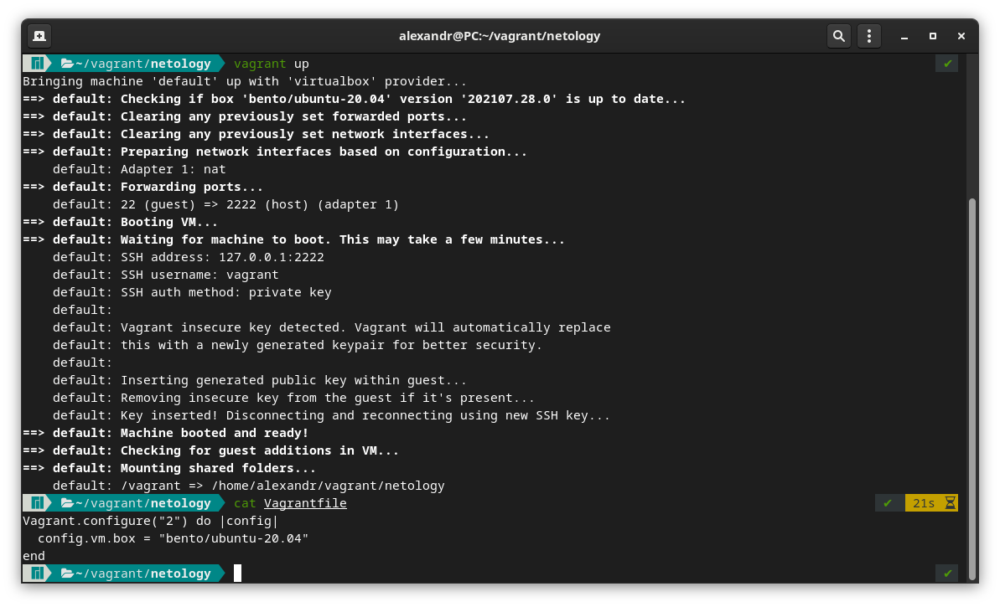
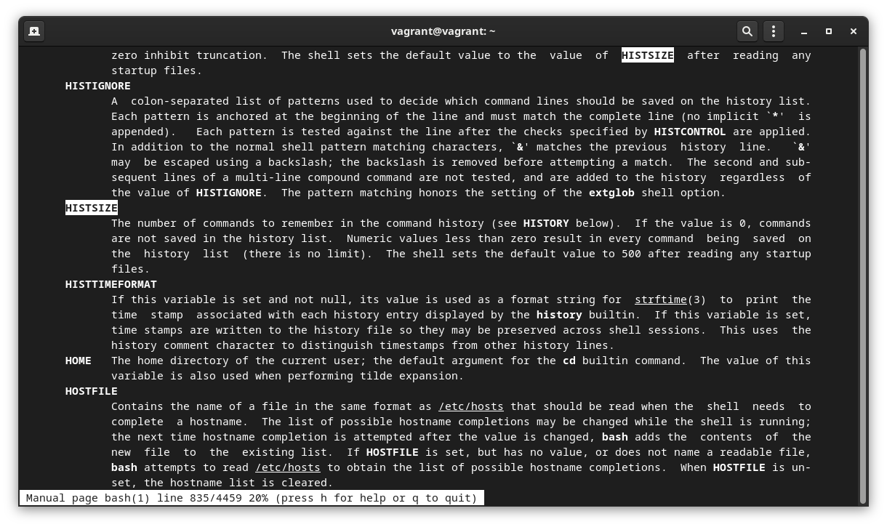
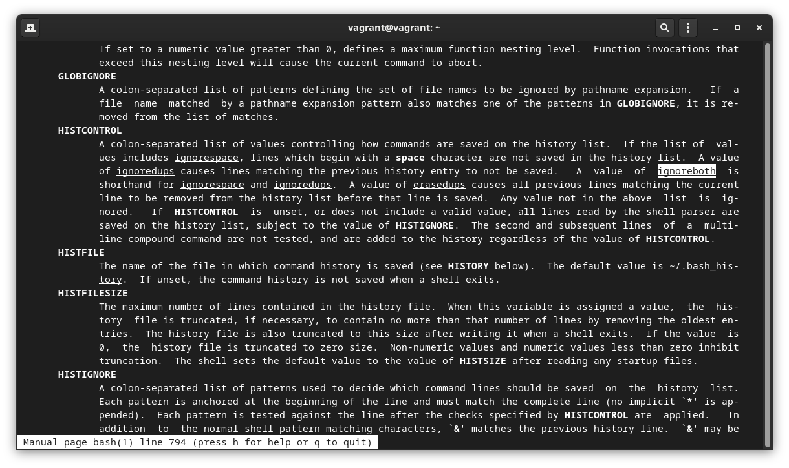
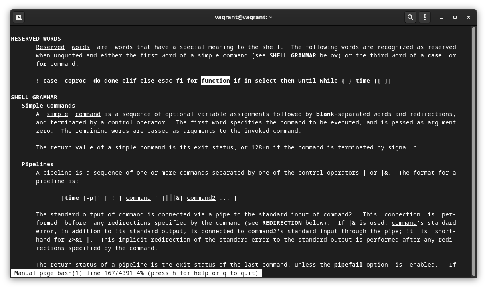
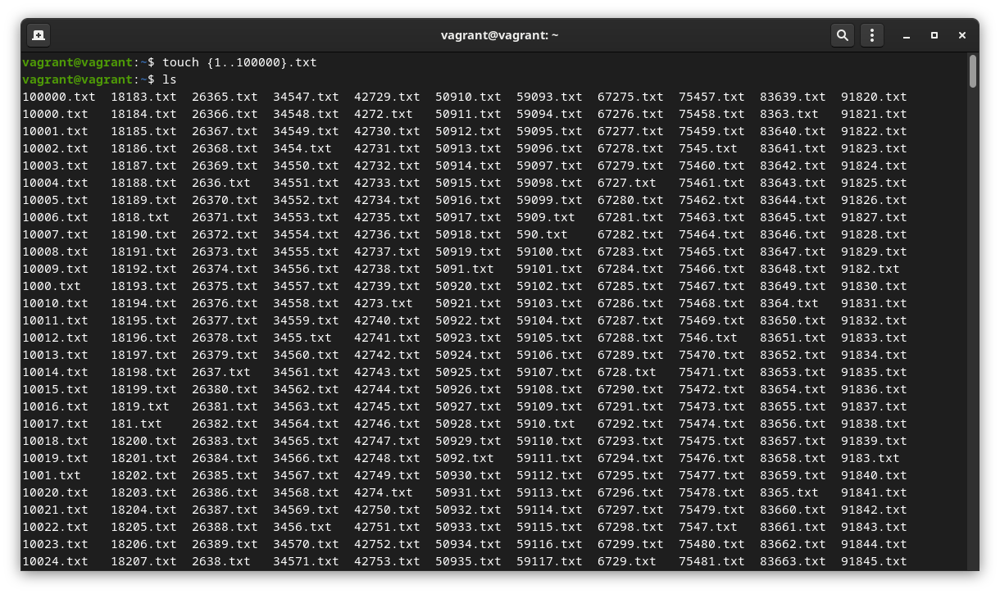

1. Vagrantfile

```
 Vagrant.configure("2") do |config|
 	config.vm.box = "bento/ubuntu-20.04"
 end
```




2. Какие ресурсы выделены по-умолчанию?

Оперативная память: 1024 МБ   
Процессоры: 2  
  

3. Как добавить оперативной памяти или ресурсов процессора виртуальной машине?

добавить оперативной пямяти и процессоров: 
```
v.memory = 2048
v.cpus = 4
```
      
`Vagrantfile`: 

```
Vagrant.configure("2") do |config|
  config.vm.box = "bento/ubuntu-20.04"
    config.vm.provider "virtualbox" do |v|
      v.memory = 2048
      v.cpus = 4
  end
end
```

4.Какой переменной можно задать длину журнала `history`, и на какой строчке manual это описывается?

```
Manual page bash(1) line 835/4459 20%
```
Отредактировать значение переменных в `.bashrc`
```
HISTSIZE=20000
HISTFILESIZE=200000
```




   
5. Что делает директива `ignoreboth` в bash?

```
ignoredups - Отключает вывод одинаковых команд
ignorespace - Игнорирует команды начинающиеся с пробела.
ignoreboth - Используется для установки обоих изнчений(ignoredups и ignorespace)

```
Описано в man bash `HISTCONTROL`:



6. В каких сценариях использования применимы скобки `{}` и на какой строчке `man bash` это описано?

Описано в man bash `RESERVED WORDS`:



7. С учётом ответа на предыдущий вопрос, как создать однократным вызовом `touch` 100000 файлов? Получится ли аналогичным образом создать 300000? Если нет, то почему?

`touch {1..100000}.txt`



```
touch {1..300000}.txt
-bash: /usr/bin/touch: Argument list too long
```
Выводится сообщение `Argument list too long` из за того что файлов больше чем допустимый лимит, проверить который можно командой
```
getconf ARG_MAX
2097152
```
Удалить фалы командой `rm` болше числа `2097152` не получится


8. В man bash поищите по `/\[\[`. Что делает конструкция `[[ -d /tmp ]]`


9. Добейтесь в выводе type -a bash в виртуальной машине наличия первым пунктом в списке `bash is /tmp/new_path_directory/bash`:

Опция `-a` показывает все места которые содержат команду 
Например:
```
type -a ll
ll is aliased to `ls -alF'
```

```
type -a bash
bash is /bin/bash
```

```
type -a pwd
pwd is a shell builtin
pwd is /bin/pwd
```


10. Чем отличается планирование команд с помощью ''batch' и 'at'?

``at``    - Используется для назначения одноразового задания на заданное время   
``batch`` - Используется для назначения одноразовых задач, которые должны выполняться, когда загрузка системы становится 0,8 (0,5)   
