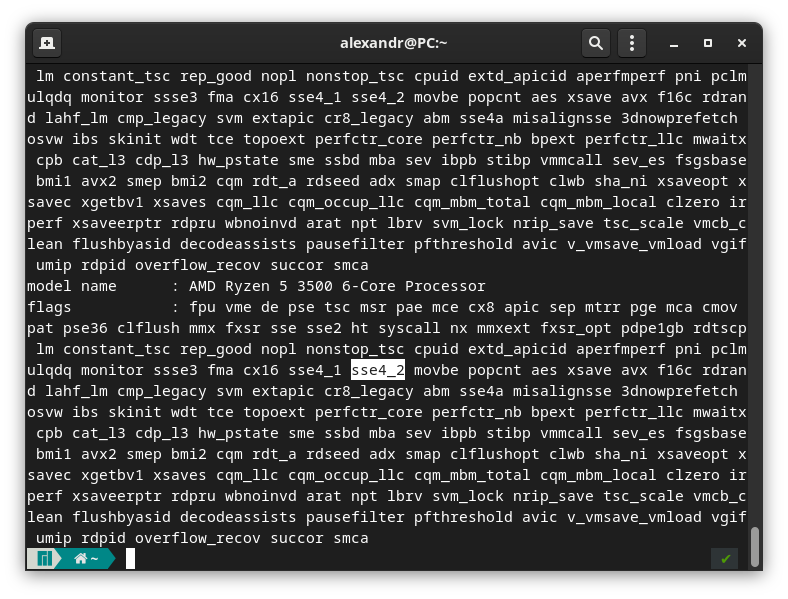
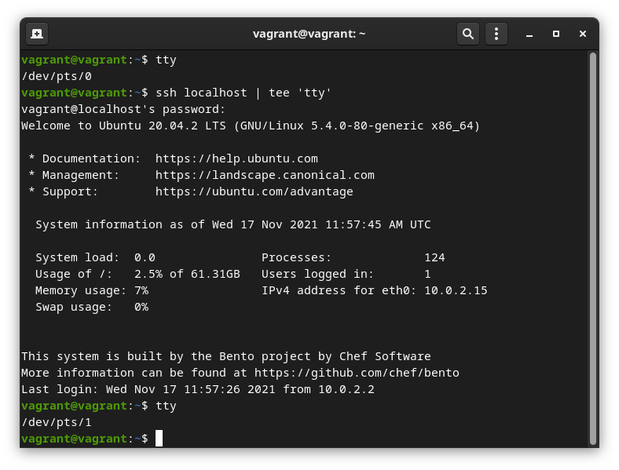

1. Какого типа команда cd?   

Команда прикладного типа `shell builtin`
Это команда или функция, вызываемая из оболочки, которая выполняется непосредственно в самой оболочке вместо внешней исполняемой программы, которую оболочка будет загружать и выполнять.  

Это команда смены каталога `cd /home/user` переместит в каталог домашний каталог пользователя user.  
Если написать команду `cd` в отличном от домашнего каталога пользователя то она переместит в него(в домашний каталог).  
`cd ..` веруться на каталог ниже, `cd ../../` для перемещения на насколько каталогов вверх, для перехода в каталог с пробелами в имени нужно экранировать имя каталога `cd /home/user/"новая папка"`  


2. Какая альтернатива без pipe?   

>Задание 2  
>Посмотрите параметры утилиты grep, может в ней уже будет нужная функция?  
>
>vagrant@vagrant:~/test$ grep test test.txt -c  
>1
>
>-c Выводит количество строк найденых в файле.

Находясь в домашней директории создать каталог `mkdir test`  
и перейти в него `cd test`  
создать в нём файл `touch test.txt` с содержимым  
```
cat test.txt   
123
```
вывод будет таким:  
```
vagrant@vagrant:~/test$ grep 123 test.txt | wc -l
1
```
Потом добавить в него ещё строку `123`  
То вывод изменится:   
```
vagrant@vagrant:~/test$ grep 123 test.txt | wc -l
2
```
Вывод показывает количество строк содержищий запрос `grep 123 test.txt | wc -l`  

Вывод с двумя `||` выдаст непосредственно содержимое в запросе
```
vagrant@vagrant:~/test$ grep 123 test.txt || wc -l
123

```
В запросе можно использовать '&&'  
```
vagrant@vagrant:~/test$ grep 123 test.txt && wc -l
123
123

^C
```
Но при этом терминал будет удерживаться и нужно будет нажать комбинацию клавишь `ctrl + c`   


3. Какой процесс с `PID 1` является родителем для всех процессов в вашей виртуальной машине Ubuntu 20.04?   

```
vagrant@vagrant:~/test$ ps aux
USER         PID %CPU %MEM    VSZ   RSS TTY      STAT START   TIME COMMAND
root           1  0.0  0.5 167252 11196 ?        Ss   11:26   0:00 /sbin/init

```
```
vagrant@vagrant:~/test$ cat /proc/1/stat
1 (systemd) S 0 1 1 0 -1 4194560 11327 98180 101 398 8 47 69 133 20 0 1 0 5 171266048 2799 18446744073709551615 1 1 0 0 0 0 671173123 4096 1260 0 0 0 17 0 0 0 23 0 0 0 0 0 0 0 0 0 0

```

```
vagrant@vagrant:~/test$ ps -A  
    PID TTY          TIME CMD  
      1 ?        00:00:00 systemd  
```


`systemd` является родителем для всех процессов  
   

4. Как будет выглядеть команда, которая перенаправит вывод `stderr ls` на другую сессию терминала?    

Терминал 1

```
vagrant@vagrant:~/test$ ls % 2>&1 | tee /dev/pts/1
ls: cannot access '%': No such file or directory

```


Терминал 2
```
vagrant@vagrant:~/test$ ls % 2>&1 | tee /dev/pts/1
ls: cannot access '%': No such file or directory

```


5. Получится ли одновременно передать команде файл на stdin и вывести ее stdout в другой файл? Приведите работающий пример.

>Задание 5  
>Попробуйте в обоих случаях использовать перенаправление.  
>
>`STDIN	  0`  
>`STDOUT	1`  
>
>`>`	Записывает данные на выходе команды вместо командной строки в файл или на устройство, например, на принтер.  
>`>&`	Считывает данные на выходе одного дескриптора как входные данные для другого дескриптора.  
>`0>&1` Считывает данные на выходе `STDIN` и передаёт как входные данные для `STDOUT`
>```
>vagrant@vagrant:~/test$ cat test.txt                                                            
>test
>netology
>
>vagrant@vagrant:~/test$ cat test.txt > netology.txt 0>&1
>test
>netology
>
>vagrant@vagrant:~/test$ cat test.txt 0>&1 netology.txt                                          
>test
>netology
>
>Или так, netology.txt был пустой
>
>vagrant@vagrant:~/test$ cat test.txt 0>&1 |tee cat netology.txt                                 
>test
>netology
>```
```
vagrant@vagrant:~/test$ cat error.log 1>&1 | tee netology.txt
ls: cannot access '%': No such file or directory
ls: cannot access '%': No such file or directory
vagrant@vagrant:~/test$ cat netology.txt 
ls: cannot access '%': No such file or directory
ls: cannot access '%': No such file or directory

```

6. Получится ли находясь в графическом режиме, вывести данные из PTY в какой-либо из эмуляторов TTY? Сможете ли вы наблюдать выводимые данные?

```
ls % 2>&1 | tee /dev/tty6 
```


7. Выполните команду bash 5>&1. К чему она приведет? Что будет, если вы выполните echo netology > /proc/$$/fd/5? Почему так происходит?

В `bash` откроется файловый дескриптор `5`  
`echo netology > /proc/$$/fd/5` выведет в него `netology`  

Как пример:

Терминал 1
```
vagrant@vagrant:~/test_pts$ echo $$
1226
```
Терминал 2
```
echo "netology" > /proc/1226/fd/0
```
Терминал 1
```
vagrant@vagrant:~/test_pts$ netology
^C
```

8.  Получится ли в качестве входного потока для `pipe` использовать только `stderr` команды, не потеряв при этом отображение `stdout` на `pty`? ...
```
vagrant@vagrant:~/test$ ls -l /root 7>&2 2>&1 1>&7 |grep denied -c 
1
```
7>&2 - новый дескриптор перенаправили в stderr   
2>&1 - stderr перенаправили в stdout   
1>&7 - stdout - перенаправили в в новый дескриптор  

9. Что выведет команда `cat /proc/$$/environ`? Как еще можно получить аналогичный по содержанию вывод?

Выводит содержимое переменной окружения    

подобное можно увидеть через команду `env`, `export`

Посмотреть для отдельного процесса:  
```
vagrant     1527  0.1  0.4  18908 10080 pts/1    S+   13:58   0:00 python3
cat /proc/1527/environ
```

10. Используя `man`, опишите что доступно по адресам `/proc/<PID>/cmdline`, `/proc/<PID>/exe`. 

```
/proc/<PID>/cmdline - полный путь до исполняемого файла процесса [PID]  (строка 231)
/proc/<PID>/exe - содержит ссылку до файла запущенного для процесса [PID], 
cat выведет содержимое запущенного файла, запуск этого файла,  запустит еще одну копию самого файла  (строка 285)
```

11. Узнайте, какую наиболее старшую версию набора инструкций SSE поддерживает ваш процессор с помощью /proc/cpuinfo.  

>11. Задание 11  
>Не совсем так, должен быть номер версии
>
>
>Если имеется в виду самая свежая то SSE4_2  
>Если самая старая то SSE  



```
cat /proc/cpuinfo | grep sse
```
`sse` самая старшая 

P.S.:
`lshw -class processor | grep -w sse`

12. При открытии нового окна терминала и `vagrant ssh` создается новая сессия и выделяется `pty`. Это можно подтвердить командой `tty`, которая упоминалась в лекции 3.2   

`ssh localhost | tee 'tty'`




13. Бывает, что есть необходимость переместить запущенный процесс из одной сессии в другую. Попробуйте сделать это, воспользовавшись `reptyr`. Например, так можно перенести в `screen` процесс, который вы запустили по ошибке в обычной SSH-сессии.   


```
vagrant@vagrant:~$ tty
/dev/pts/0
vagrant@vagrant:~$ top
```

```
vagrant@vagrant:~$ tty
/dev/pts/1
vagrant@vagrant:~$ ps -a
    PID TTY          TIME CMD
   1111 pts/0    00:00:00 top
   1112 pts/1    00:00:00 ps
vagrant@vagrant:~$ reptyr 1111
```

14. `sudo tee`
`sudo echo string > /root/new_file`
`sudo` не выполняет перенаправление вывода, перенаправление выполняется как непривилегированный пользователь

`echo string | sudo tee /root/new_file`
`tee` получит вывод команды echo , повысит права на sudo и запишет в файл.


- - -

```
vagrant@vagrant:~/test$ ls %
ls: cannot access '%': No such file or directory
vagrant@vagrant:~/test$  ls %  2>>error.log
vagrant@vagrant:~/test$ ls
error.log  test.txt
vagrant@vagrant:~/test$ cat error.log 
ls: cannot access '%': No such file or directory
```

```
vagrant@vagrant:~/test$ ls %  &> error.log
vagrant@vagrant:~/test$ cat error.log 
ls: cannot access '%': No such file or 
```

```
vagrant@vagrant:~/test$ ls %  &>> error.log
vagrant@vagrant:~/test$ cat error.log 
ls: cannot access '%': No such file or directory
ls: cannot access '%': No such file or directory
```

