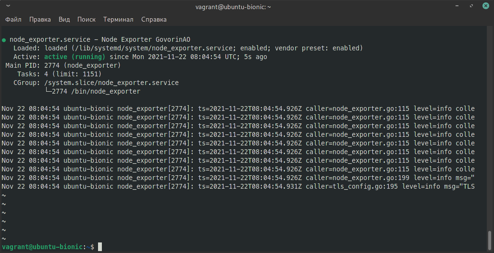
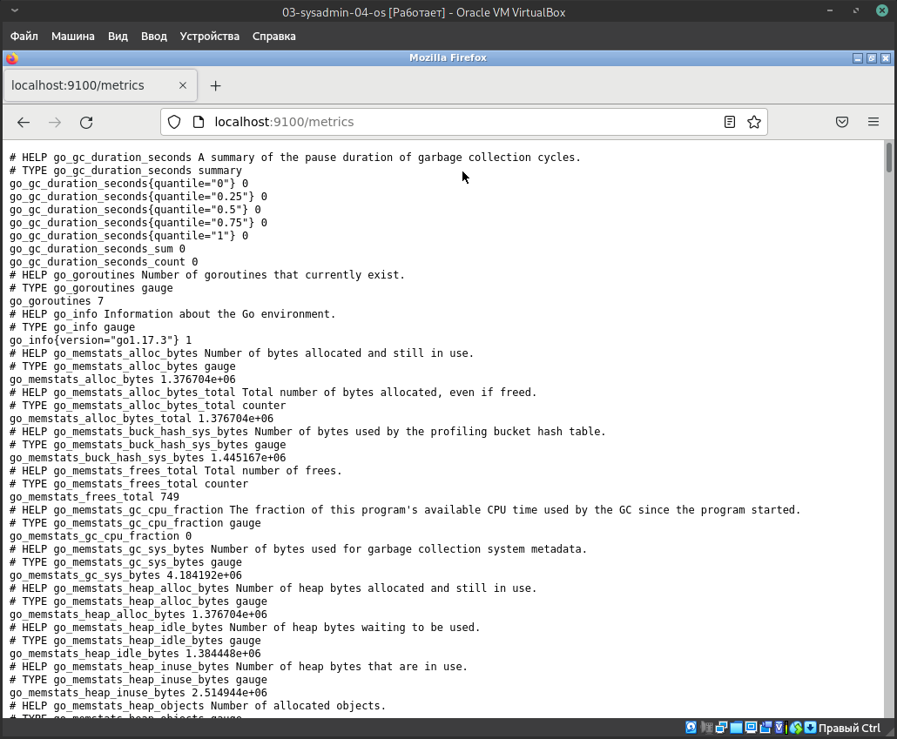
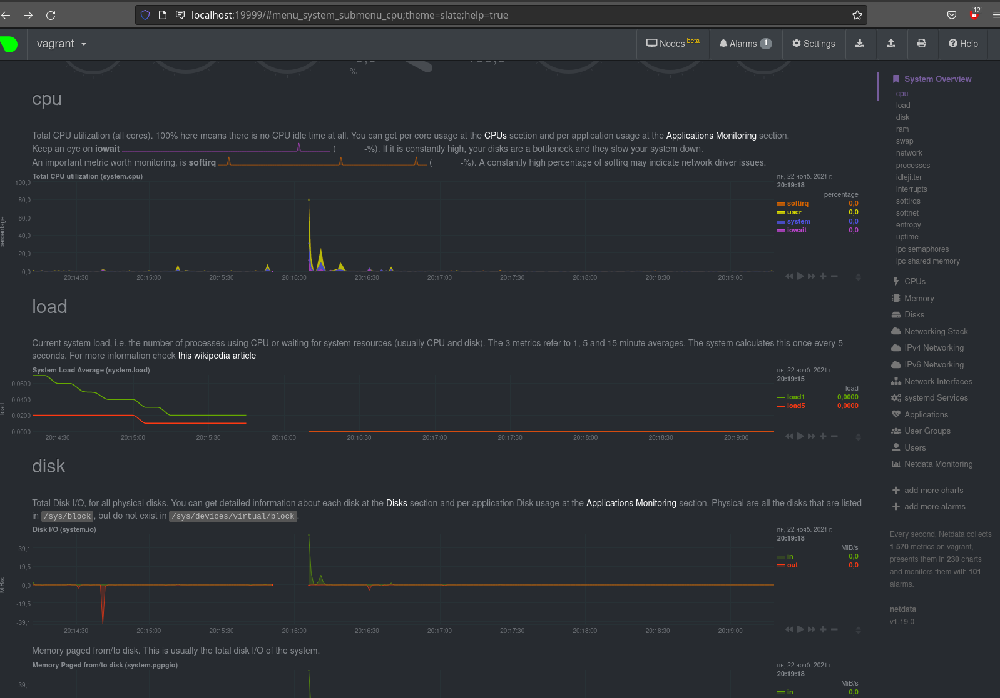
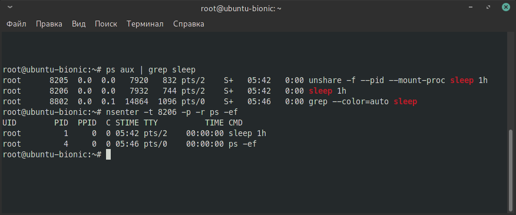
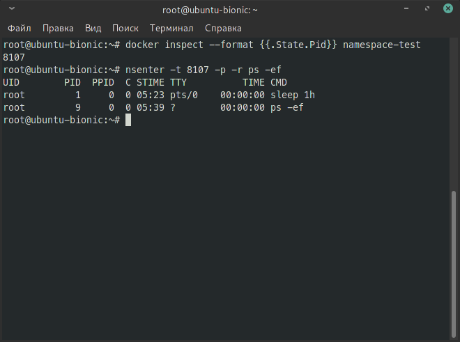

# Домашнее задание к занятию "3.4. Операционные системы, лекция 2" 

#### 1. node_exporter  
- 

`sudo vi /lib/systemd/system/node_exporter.service`

Выставляем права (Все пользователи имеют право чтения; владелец может редактировать):

`sudo chmod 644 /lib/systemd/system/node_exporter.service`  

Обновляем конфигурацию и добавить в автозагрузку:  

`sudo systemctl daemon-reload`

`sudo systemctl enable node_exporter.service`

- 



```
vagrant@ubuntu-bionic:~$ systemctl cat node_exporter.service 
# /lib/systemd/system/node_exporter.service
[Unit]
Description=Node Exporter GovorinAO
After=multi-user.target

[Service]
EnvironmentFile=-/etc/default/node_exporter
ExecStart=/bin/node_exporter $EXTRA_OPTS
IgnoreSIGPIPE=false
KillMode=process

[Install]
WantedBy=multi-user.target
```
-

#### 2.  Ознакомьтесь с опциями node_exporter и выводом /metrics по-умолчанию. Приведите несколько опций, которые вы бы выбрали для базового мониторинга хоста по CPU, памяти, диску и сети.   

- 


- 

`curl http://localhost:9100/metrics`

`curl http://localhost:9100/metrics | grep cpu`  
...  
...

```
# TYPE process_cpu_seconds_total counter
process_cpu_seconds_total 0.55

# TYPE node_cpu_seconds_total counter
node_cpu_seconds_total{cpu="0",mode="idle"} 812.1
node_cpu_seconds_total{cpu="0",mode="iowait"} 1.55
node_cpu_seconds_total{cpu="0",mode="irq"} 0
node_cpu_seconds_total{cpu="0",mode="nice"} 0.02
node_cpu_seconds_total{cpu="0",mode="softirq"} 0.1
node_cpu_seconds_total{cpu="0",mode="steal"} 0
node_cpu_seconds_total{cpu="0",mode="system"} 7.77
node_cpu_seconds_total{cpu="0",mode="user"} 17.71
node_cpu_seconds_total{cpu="1",mode="idle"} 809.04
node_cpu_seconds_total{cpu="1",mode="iowait"} 2.05
node_cpu_seconds_total{cpu="1",mode="irq"} 0
node_cpu_seconds_total{cpu="1",mode="nice"} 0.02
node_cpu_seconds_total{cpu="1",mode="softirq"} 0.52
node_cpu_seconds_total{cpu="1",mode="steal"} 0
node_cpu_seconds_total{cpu="1",mode="system"} 6.94
node_cpu_seconds_total{cpu="1",mode="user"} 18.66


# TYPE node_memory_MemAvailable_bytes gauge
node_memory_MemAvailable_bytes 1.678647296e+09
100 59846    0 59846    0     0  9740k      0 --:--:-- --:--:-- --:--:-- 9740k

# TYPE node_memory_MemFree_bytes gauge
node_memory_MemFree_bytes 1.465667584e+09
100 59854    0 59854    0     0  19.0M      0 --:--:-- --:--:-- --:--:-- 19.0M


# TYPE node_network_up gauge
node_network_up{device="eth0"} 1

# TYPE node_network_receive_errs_total counter
node_network_receive_errs_total{device="eth0"} 0

# TYPE node_network_transmit_errs_total counter
node_network_transmit_errs_total{device="eth0"} 0

# TYPE node_network_receive_bytes_total counter
node_network_receive_bytes_total{device="eth0"} 46662

# TYPE node_network_transmit_bytes_total counter
node_network_transmit_bytes_total{device="eth0"} 60067


# TYPE node_disk_io_time_seconds_total counter
node_disk_io_time_seconds_total{device="dm-0"} 4.696
node_disk_io_time_seconds_total{device="dm-1"} 0.06
node_disk_io_time_seconds_total{device="sda"} 4.756

# TYPE node_disk_read_bytes_total counter
node_disk_read_bytes_total{device="dm-0"} 3.70123776e+08
node_disk_read_bytes_total{device="dm-1"} 3.342336e+06
node_disk_read_bytes_total{device="sda"} 3.8388224e+08

# TYPE node_disk_read_time_seconds_total counter
node_disk_read_time_seconds_total{device="dm-0"} 16.264
node_disk_read_time_seconds_total{device="dm-1"} 0.052000000000000005
node_disk_read_time_seconds_total{device="sda"} 8.546

# TYPE node_disk_write_time_seconds_total counter
node_disk_write_time_seconds_total{device="dm-0"} 0.8280000000000001
node_disk_write_time_seconds_total{device="dm-1"} 0
node_disk_write_time_seconds_total{device="sda"} 0.665

```

#### 3. Netdata  



#### 4. Можно ли по выводу dmesg понять, осознает ли ОС, что загружена не на настоящем оборудовании, а на системе виртуализации?   

Можно, например выводится сообщение `Hypervisor detected`  


```
vagrant@vagrant:~$ dmesg | grep KVM
[    0.000000] Hypervisor detected: KVM
[    0.035175] Booting paravirtualized kernel on KVM

```

#### 5. Как настроен sysctl fs.nr_open на системе по-умолчанию? Узнайте, что означает этот параметр. Какой другой существующий лимит не позволит достичь такого числа (ulimit --help)?  

```
vagrant@vagrant:~$ sysctl fs.nr_open
fs.nr_open = 1048576
```

https://www.kernel.org/doc/Documentation/sysctl/fs.txt


```
nr_open:

This denotes the maximum number of file-handles a process can
allocate. Default value is 1024*1024 (1048576) which should be
enough for most machines. Actual limit depends on RLIMIT_NOFILE
resource limit.
```

```
Это означает максимальное количество файловых дескрипторов, которые может выполнять процесс.
выделить. Значение по умолчанию - 1024 * 1024 (1048576), что должно хватит на большинство машин. 
Фактический лимит зависит от RLIMIT_NOFILE ограничение ресурса.
```

`ulimit --help`   

```
Значения указаны с шагом 1024 байта, за исключением -t, который задается в секундах,
     -p с шагом 512 байт и -u немасштабируемый
     количество процессов.
```

#### 6. Запустите любой долгоживущий процесс (не `ls`, который отработает мгновенно, а, например, `sleep 1h`) в отдельном неймспейсе процессов; покажите, что ваш процесс работает под PID 1 через `nsenter`.   
 
 - unshare  

Терминал 1

```
root@ubuntu-bionic:~# unshare -f --pid --mount-proc sleep 1h
```

Терминал 2

```
root@ubuntu-bionic:~# ps aux | grep sleep
root      8205  0.0  0.0   7920   832 pts/2    S+   05:42   0:00 unshare -f --pid --mount-proc sleep 1h
root      8206  0.0  0.0   7932   744 pts/2    S+   05:42   0:00 sleep 1h
root      8802  0.0  0.1  14864  1096 pts/0    S+   05:46   0:00 grep --color=auto sleep
root@ubuntu-bionic:~# nsenter -t 8206 -p -r ps -ef
UID        PID  PPID  C STIME TTY          TIME CMD
root         1     0  0 05:42 pts/2    00:00:00 sleep 1h
root         4     0  0 05:46 pts/0    00:00:00 ps -ef
```



---

 - Docker  

Терминал 1  
```
docker run -it --name namespace-test ubuntu sleep 1h
```
Терминал 2   
```
docker inspect --format {{.State.Pid}} namespace-test
PID 8107
nsenter -t 8107 -p -r ps -ef
UID        PID  PPID  C STIME TTY          TIME CMD
root         1     0  0 05:23 pts/0    00:00:00 sleep 1h
root         7     0  0 05:29 ?        00:00:00 ps -ef
```


---
```
root@vagrant:~# sleep 1h
```

```
root@vagrant:~# ps -e | grep sleep
   1775 pts/0    00:00:00 sleep

```
---
#### 7. `:(){ :|:& };:`   


   >При запуске проиходит:
   >Эта функция которая создаёт две свои копии при каждом вызове, запускает их в фотоном режиме, и происходит это пока не закончатся системные ресурсы.

   >Указаны
   >Установленые Hard лдимиты  
   >vagrant@vagrant:~$ ulimit -Hn  
   >1048576

   >Установленые Soft лдимиты    
   >vagrant@vagrant:~$ ulimit -Sn  
   >1024


   >```bash
   >vagrant@vagrant:~$ dmesg | grep fork
   >[   33.928954] cgroup: fork rejected by pids controller in /user.slice/user-1000.slice/session-4.scope
   >vagrant@vagrant:~$ dmesg | grep cgroup
   >[    0.061481] *** VALIDATE cgroup1 ***
   >[    0.061482] *** VALIDATE cgroup2 ***
   >[   33.928954] cgroup: fork rejected by pids controller in /user.slice/user-1000.slice/session-4.scope
   >```
   >


```
-bash: fork: retry: Resource temporarily unavailable
-bash: fork: retry: Resource temporarily unavailable
-bash: fork: Resource temporarily unavailable
-bash: fork: Resource temporarily unavailable
-bash: fork: retry: Resource temporarily unavailable
-bash: fork: Resource temporarily unavailable
-bash: fork: Resource temporarily unavailable

```

https://en.wikipedia.org/wiki/Fork_bomb

```
:() означает, что вы определяете функцию под названием :

{:|: &}означает запустить функцию :и :снова отправить ее вывод в функцию и запустить ее в фоновом режиме.

Это ;разделитель команд.

: запускает функцию в первый раз.

По сути, вы создаете функцию, которая вызывает себя дважды при каждом вызове и не имеет возможности завершить себя. Он будет удваиваться, пока у вас не закончатся системные ресурсы.
```
Лимиты описаны в файле:  
/etc/security/limits.conf

Изначальнго там лимиты не указаны.
> В файле все закоментировано.

