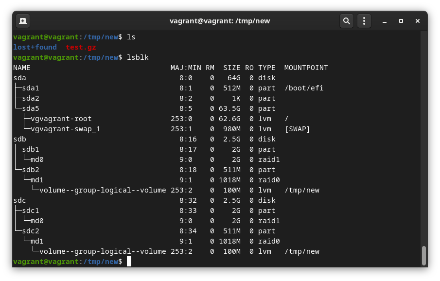
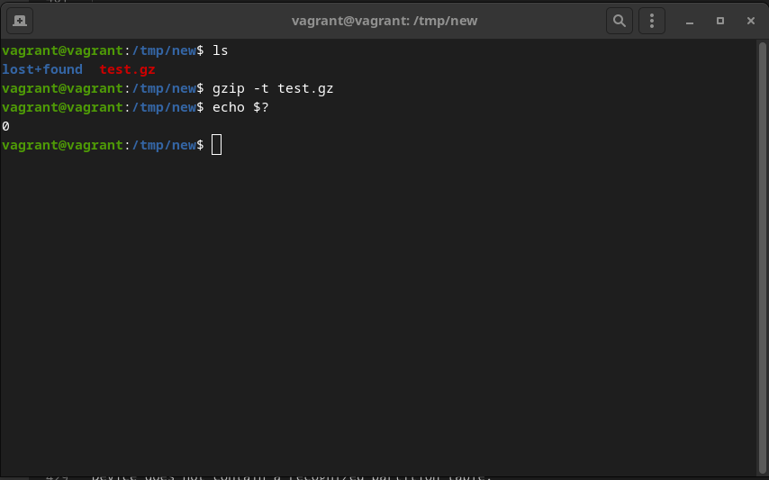

# Домашнее задание к занятию "3.5. Файловые системы"

1. Узнайте о `sparse` (разряженных) файлах.

    Прочитал википедию, 

    [Разрежённый файл](https://ru.wikipedia.org/wiki/%D0%A0%D0%B0%D0%B7%D1%80%D0%B5%D0%B6%D1%91%D0%BD%D0%BD%D1%8B%D0%B9_%D1%84%D0%B0%D0%B9%D0%BB)    


1. Могут ли файлы, являющиеся жесткой ссылкой на один объект, иметь разные права доступа и владельца? Почему?  

    При изменении прав, что у `hardlink`, что у фала права меняются в обоих случаях.  
    Права доступа не могут быть разные потому что, `hardlink` это ссылка на файл и они имеют один `inode` по этому права будут одни и те же.

    
    ```
    vagrant@vagrant:~$ ls
    part_sdb

    vagrant@vagrant:~$ ln part_sdb part_sdb_link
    vagrant@vagrant:~$ ls -l
    total 8
    -rw-rw-r-- 2 vagrant vagrant 182 Nov 24 11:22 part_sdb
    -rw-rw-r-- 2 vagrant vagrant 182 Nov 24 11:22 part_sdb_link

    vagrant@vagrant:~$ chmod 775 part_sdb
    vagrant@vagrant:~$ ls -l
    total 8
    -rwxrwxr-x 2 vagrant vagrant 182 Nov 24 11:22 part_sdb
    -rwxrwxr-x 2 vagrant vagrant 182 Nov 24 11:22 part_sdb_link

    vagrant@vagrant:~$ chmod 644 part_sdb_link 
    vagrant@vagrant:~$ ls -l
    total 8
    -rw-r--r-- 2 vagrant vagrant 182 Nov 24 11:22 part_sdb
    -rw-r--r-- 2 vagrant vagrant 182 Nov 24 11:22 part_sdb_link

    ```

1. Vagrantfile

    ```bash
    Vagrant.configure("2") do |config|
      config.vm.box = "bento/ubuntu-20.04"
      config.vm.provider :virtualbox do |vb|
        lvm_experiments_disk0_path = "/tmp/lvm_experiments_disk0.vmdk"
        lvm_experiments_disk1_path = "/tmp/lvm_experiments_disk1.vmdk"
        vb.customize ['createmedium', '--filename', lvm_experiments_disk0_path, '--size', 2560]
        vb.customize ['createmedium', '--filename', lvm_experiments_disk1_path, '--size', 2560]
        vb.customize ['storageattach', :id, '--storagectl', 'SATA Controller', '--port', 1, '--device', 0, '--type', 'hdd', '--medium', lvm_experiments_disk0_path]
        vb.customize ['storageattach', :id, '--storagectl', 'SATA Controller', '--port', 2, '--device', 0, '--type', 'hdd', '--medium', lvm_experiments_disk1_path]
      end
    end
    ```


1. Используя `fdisk`, разбейте первый диск на 2 раздела: 2 Гб, оставшееся пространство.

    ```s

    vagrant@vagrant:~$ sudo fdisk /dev/sdb

    Welcome to fdisk (util-linux 2.34).
    Changes will remain in memory only, until you decide to write them.
    Be careful before using the write command.

    Device does not contain a recognized partition table.
    Created a new DOS disklabel with disk identifier 0x70007235.

    Command (m for help): n
    Partition type
    p   primary (0 primary, 0 extended, 4 free)
    e   extended (container for logical partitions)
    Select (default p): 

    Using default response p.
    Partition number (1-4, default 1): 
    First sector (2048-5242879, default 2048): 
    Last sector, +/-sectors or +/-size{K,M,G,T,P} (2048-5242879, default 5242879): +2G

    Created a new partition 1 of type 'Linux' and of size 2 GiB.

    Command (m for help): n
    Partition type
    p   primary (1 primary, 0 extended, 3 free)
    e   extended (container for logical partitions)
    Select (default p): 

    Using default response p.
    Partition number (2-4, default 2): 
    First sector (4196352-5242879, default 4196352): 
    Last sector, +/-sectors or +/-size{K,M,G,T,P} (4196352-5242879, default 5242879): 

    Created a new partition 2 of type 'Linux' and of size 511 MiB.

    Command (m for help): w
    The partition table has been altered.
    Calling ioctl() to re-read partition table.
    Syncing disks.

    vagrant@vagrant:~$ lsblk
    NAME                 MAJ:MIN RM  SIZE RO TYPE MOUNTPOINT
    sda                    8:0    0   64G  0 disk 
    ├─sda1                 8:1    0  512M  0 part /boot/efi
    ├─sda2                 8:2    0    1K  0 part 
    └─sda5                 8:5    0 63.5G  0 part 
    ├─vgvagrant-root   253:0    0 62.6G  0 lvm  /
    └─vgvagrant-swap_1 253:1    0  980M  0 lvm  [SWAP]
    sdb                    8:16   0  2.5G  0 disk 
    ├─sdb1                 8:17   0    2G  0 part 
    └─sdb2                 8:18   0  511M  0 part 
    sdc                    8:32   0  2.5G  0 disk 
    ```


1. Используя `sfdisk`, перенесите данную таблицу разделов на второй диск.

    ```bash
    vagrant@vagrant:~$ sudo sfdisk -d /dev/sdb > part_sdb
    vagrant@vagrant:~$ ls part_sdb 
    part_sdb
    vagrant@vagrant:~$ cat part_sdb 
    label: dos
    label-id: 0x70007235
    device: /dev/sdb
    unit: sectors

    /dev/sdb1 : start=        2048, size=     4194304, type=83
    /dev/sdb2 : start=     4196352, size=     1046528, type=83
    vagrant@vagrant:~$ sudo sfdisk /dev/sdc < part_sdb 
    Checking that no-one is using this disk right now ... OK

    Disk /dev/sdc: 2.51 GiB, 2684354560 bytes, 5242880 sectors
    Disk model: VBOX HARDDISK   
    Units: sectors of 1 * 512 = 512 bytes
    Sector size (logical/physical): 512 bytes / 512 bytes
    I/O size (minimum/optimal): 512 bytes / 512 bytes

    >>> Script header accepted.
    >>> Script header accepted.
    >>> Script header accepted.
    >>> Script header accepted.
    >>> Created a new DOS disklabel with disk identifier 0x70007235.
    /dev/sdc1: Created a new partition 1 of type 'Linux' and of size 2 GiB.
    /dev/sdc2: Created a new partition 2 of type 'Linux' and of size 511 MiB.
    /dev/sdc3: Done.

    New situation:
    Disklabel type: dos
    Disk identifier: 0x70007235

    Device     Boot   Start     End Sectors  Size Id Type
    /dev/sdc1          2048 4196351 4194304    2G 83 Linux
    /dev/sdc2       4196352 5242879 1046528  511M 83 Linux

    The partition table has been altered.
    Calling ioctl() to re-read partition table.
    Syncing disks.
    vagrant@vagrant:~$ 


    vagrant@vagrant:~$ lsblk
    NAME                 MAJ:MIN RM  SIZE RO TYPE MOUNTPOINT
    sda                    8:0    0   64G  0 disk 
    ├─sda1                 8:1    0  512M  0 part /boot/efi
    ├─sda2                 8:2    0    1K  0 part 
    └─sda5                 8:5    0 63.5G  0 part 
    ├─vgvagrant-root   253:0    0 62.6G  0 lvm  /
    └─vgvagrant-swap_1 253:1    0  980M  0 lvm  [SWAP]
    sdb                    8:16   0  2.5G  0 disk 
    ├─sdb1                 8:17   0    2G  0 part 
    └─sdb2                 8:18   0  511M  0 part 
    sdc                    8:32   0  2.5G  0 disk 
    ├─sdc1                 8:33   0    2G  0 part 
    └─sdc2                 8:34   0  511M  0 part 
    vagrant@vagrant:~$ 
    ```

1. Соберите `mdadm` RAID1 на паре разделов 2 Гб.

    ```bash
    vagrant@vagrant:~$ sudo wipefs --all --force /dev/sd{b1,c1}
    vagrant@vagrant:~$ sudo mdadm --create --verbose /dev/md0 -l 1 -n 2 /dev/sd{b1,c1}
    mdadm: Note: this array has metadata at the start and
        may not be suitable as a boot device.  If you plan to
        store '/boot' on this device please ensure that
        your boot-loader understands md/v1.x metadata, or use
        --metadata=0.90
    mdadm: size set to 2094080K
    Continue creating array? yes
    mdadm: Defaulting to version 1.2 metadata
    mdadm: array /dev/md0 started.
    vagrant@vagrant:~$ lsblk
    NAME                 MAJ:MIN RM  SIZE RO TYPE  MOUNTPOINT
    sda                    8:0    0   64G  0 disk  
    ├─sda1                 8:1    0  512M  0 part  /boot/efi
    ├─sda2                 8:2    0    1K  0 part  
    └─sda5                 8:5    0 63.5G  0 part  
    ├─vgvagrant-root   253:0    0 62.6G  0 lvm   /
    └─vgvagrant-swap_1 253:1    0  980M  0 lvm   [SWAP]
    sdb                    8:16   0  2.5G  0 disk  
    ├─sdb1                 8:17   0    2G  0 part  
    │ └─md0                9:0    0    2G  0 raid1 
    └─sdb2                 8:18   0  511M  0 part  
    sdc                    8:32   0  2.5G  0 disk  
    ├─sdc1                 8:33   0    2G  0 part  
    │ └─md0                9:0    0    2G  0 raid1 
    └─sdc2                 8:34   0  511M  0 part  
    vagrant@vagrant:~$ 
    ```

    `sudo mdadm --create --verbose /dev/md0 -l 1 -n 2 /dev/sd{b1,c1}`   
    `/dev/md0` - устроство которое будет создано   
    `-l 1` - тип рейда RAID 1  
    `-n 2` - кол-во дисков 2  
    `/dev/sd{b1,c1}` - устройства /dev/sdb1 /dev/sdc1  


1. Соберите `mdadm` RAID0 на второй паре маленьких разделов.

    ```bash
    vagrant@vagrant:~$ sudo mdadm --create --verbose /dev/md1 -l 0 -n 2 /dev/sd{b2,c2}
    mdadm: chunk size defaults to 512K
    mdadm: Defaulting to version 1.2 metadata
    mdadm: array /dev/md1 started.
    vagrant@vagrant:~$ lsblk
    NAME                 MAJ:MIN RM  SIZE RO TYPE  MOUNTPOINT
    sda                    8:0    0   64G  0 disk  
    ├─sda1                 8:1    0  512M  0 part  /boot/efi
    ├─sda2                 8:2    0    1K  0 part  
    └─sda5                 8:5    0 63.5G  0 part  
    ├─vgvagrant-root   253:0    0 62.6G  0 lvm   /
    └─vgvagrant-swap_1 253:1    0  980M  0 lvm   [SWAP]
    sdb                    8:16   0  2.5G  0 disk  
    ├─sdb1                 8:17   0    2G  0 part  
    │ └─md0                9:0    0    2G  0 raid1 
    └─sdb2                 8:18   0  511M  0 part  
    └─md1                9:1    0 1018M  0 raid0 
    sdc                    8:32   0  2.5G  0 disk  
    ├─sdc1                 8:33   0    2G  0 part  
    │ └─md0                9:0    0    2G  0 raid1 
    └─sdc2                 8:34   0  511M  0 part  
    └─md1                9:1    0 1018M  0 raid0 
    vagrant@vagrant:~$ 
    ```

1. Создайте 2 независимых PV на получившихся md-устройствах.  

    ```bash

    vagrant@vagrant:~$ sudo pvcreate /dev/md0 /dev/md0
    Device /dev/md0 excluded by a filter.
    Physical volume "/dev/md0" successfully created.
    
    vagrant@vagrant:~$ sudo pvcreate /dev/md1 /dev/md1
    Device /dev/md1 excluded by a filter.
    Physical volume "/dev/md1" successfully created.

    ```

    ```bash
    vagrant@vagrant:~$ sudo pvscan
    PV /dev/sda5   VG vgvagrant       lvm2 [<63.50 GiB / 0    free]
    PV /dev/md0                       lvm2 [<2.00 GiB]
    PV /dev/md1                       lvm2 [1018.00 MiB]
    Total: 3 [<66.49 GiB] / in use: 1 [<63.50 GiB] / in no VG: 2 [2.99 GiB]
    ```

1. Создайте общую volume-group на этих двух PV.

    ```bash
    vagrant@vagrant:~$ sudo vgcreate volume-group /dev/md0 /dev/md1
    Volume group "volume-group" successfully created
    vagrant@vagrant:~$ sudo vgdisplay
    --- Volume group ---
    VG Name               vgvagrant
    System ID             
    Format                lvm2
    Metadata Areas        1
    Metadata Sequence No  3
    VG Access             read/write
    VG Status             resizable
    MAX LV                0
    Cur LV                2
    Open LV               2
    Max PV                0
    Cur PV                1
    Act PV                1
    VG Size               <63.50 GiB
    PE Size               4.00 MiB
    Total PE              16255
    Alloc PE / Size       16255 / <63.50 GiB
    Free  PE / Size       0 / 0   
    VG UUID               PaBfZ0-3I0c-iIdl-uXKt-JL4K-f4tT-kzfcyE
    
    --- Volume group ---
    VG Name               volume-group
    System ID             
    Format                lvm2
    Metadata Areas        2
    Metadata Sequence No  1
    VG Access             read/write
    VG Status             resizable
    MAX LV                0
    Cur LV                0
    Open LV               0
    Max PV                0
    Cur PV                2
    Act PV                2
    VG Size               <2.99 GiB
    PE Size               4.00 MiB
    Total PE              765
    Alloc PE / Size       0 / 0   
    Free  PE / Size       765 / <2.99 GiB
    VG UUID               lhVpKm-pyiO-e2v3-2RAm-86cl-aIED-z2u0mp
    ```

1. Создайте LV размером 100 Мб, указав его расположение на PV с RAID0.

    ```bash
    vagrant@vagrant:~$ sudo lvcreate -L 100M -n logical-volume volume-group /dev/md1
    Logical volume "logical-volume" created.  
    ```

    ```bash
    vagrant@vagrant:~$ lsblk
    NAME                                MAJ:MIN RM  SIZE RO TYPE  MOUNTPOINT
    sda                                   8:0    0   64G  0 disk  
    ├─sda1                                8:1    0  512M  0 part  /boot/efi
    ├─sda2                                8:2    0    1K  0 part  
    └─sda5                                8:5    0 63.5G  0 part  
    ├─vgvagrant-root                  253:0    0 62.6G  0 lvm   /
    └─vgvagrant-swap_1                253:1    0  980M  0 lvm   [SWAP]
    sdb                                   8:16   0  2.5G  0 disk  
    ├─sdb1                                8:17   0    2G  0 part  
    │ └─md0                               9:0    0    2G  0 raid1 
    └─sdb2                                8:18   0  511M  0 part  
    └─md1                               9:1    0 1018M  0 raid0 
        └─volume--group-logical--volume 253:2    0  100M  0 lvm   
    sdc                                   8:32   0  2.5G  0 disk  
    ├─sdc1                                8:33   0    2G  0 part  
    │ └─md0                               9:0    0    2G  0 raid1 
    └─sdc2                                8:34   0  511M  0 part  
    └─md1                               9:1    0 1018M  0 raid0 
        └─volume--group-logical--volume 253:2    0  100M  0 lvm   
    ```

1. Создайте `mkfs.ext4` ФС на получившемся LV.

    ```bash
    vagrant@vagrant:~$ sudo mkfs.ext4 /dev/mapper/volume--group-logical--volume
    mke2fs 1.45.5 (07-Jan-2020)
    Creating filesystem with 25600 4k blocks and 25600 inodes

    Allocating group tables: done                            
    Writing inode tables: done                            
    Creating journal (1024 blocks): done
    Writing superblocks and filesystem accounting information: done

    ```

1. Смонтируйте этот раздел в любую директорию, например, `/tmp/new`.

    ```bash
    agrant@vagrant:~$ sudo mount /dev/mapper/volume--group-logical--volume /tmp/new
    mount: /tmp/new: /dev/mapper/volume--group-logical--volume already mounted on /tmp/new.
    ```

1. Поместите туда тестовый файл, например `wget https://mirror.yandex.ru/ubuntu/ls-lR.gz -O /tmp/new/test.gz`.  

    ```bash
    vagrant@vagrant:/tmp/new$ sudo wget https://mirror.yandex.ru/ubuntu/ls-lR.gz -O /tmp/new/test.gz
    --2021-11-24 12:30:53--  https://mirror.yandex.ru/ubuntu/ls-lR.gz
    Resolving mirror.yandex.ru (mirror.yandex.ru)... 213.180.204.183, 2a02:6b8::183
    Connecting to mirror.yandex.ru (mirror.yandex.ru)|213.180.204.183|:443... connected.
    HTTP request sent, awaiting response... 200 OK
    Length: 22579032 (22M) [application/octet-stream]
    Saving to: ‘/tmp/new/test.gz’

    /tmp/new/test.gz        100%[============================>]  21.53M  11.0MB/s    in 2.0s    

    2021-11-24 12:30:55 (11.0 MB/s) - ‘/tmp/new/test.gz’ saved [22579032/22579032]

    vagrant@vagrant:/tmp/new$ ls
    lost+found  test.gz
    ```

1. Прикрепите вывод `lsblk`.





1. Протестируйте целостность файла:

    ```bash
    root@vagrant:~# gzip -t /tmp/new/test.gz
    root@vagrant:~# echo $?
    0
    ```




1. Используя pvmove, переместите содержимое PV с RAID0 на RAID1.

    ```bash
    vagrant@vagrant:~$ sudo pvmove /dev/md1 /dev/md0
    /dev/md1: Moved: 8.00%
    /dev/md1: Moved: 100.00%
    ```

1. Сделайте `--fail` на устройство в вашем RAID1 md.

    ```bash
    vagrant@vagrant:sudo mdadm ~$ /dev/md0 --fail /dev/sdb1
    mdadm: set /dev/sdb1 faulty in /dev/md0
    ```

1. Подтвердите выводом `dmesg`, что RAID1 работает в деградированном состоянии.

    ```bash
    vagrant@vagrant:~$ dmesg | grep md0
    [  765.766053] md/raid1:md0: not clean -- starting background reconstruction
    [  765.766055] md/raid1:md0: active with 2 out of 2 mirrors
    [  765.766067] md0: detected capacity change from 0 to 2144337920
    [  765.771603] md: resync of RAID array md0
    [  776.218432] md: md0: resync done.
    [ 5407.727262] md/raid1:md0: Disk failure on sdb1, disabling device.
                md/raid1:md0: Operation continuing on 1 devices.
    ```

1. Протестируйте целостность файла, несмотря на "сбойный" диск он должен продолжать быть доступен:

    ```bash
    root@vagrant:~# gzip -t /tmp/new/test.gz
    root@vagrant:~# echo $?
    0
    ```

    ```bash
    vagrant@vagrant:~$ gzip -t /tmp/new/test.gz
    vagrant@vagrant:~$ echo $?
    0

    ```


1. Погасите тестовый хост, `vagrant destroy`.


---
P.S.

В [img](img) есть другие скриншоты