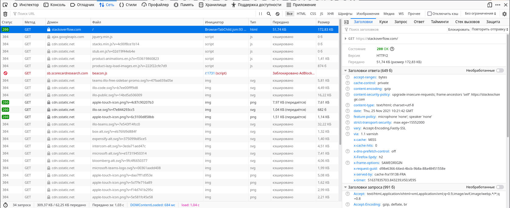
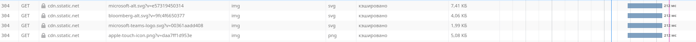

# Домашнее задание к занятию "3.6. Компьютерные сети, лекция 1"  

1. 

    telnet stackoverflow.com 80                                     
    Trying 151.101.65.69...
    Connected to stackoverflow.com.
    Escape character is '^]'.
    GET /questions HTTP/1.0
    HOST: stackoverflow.com

    HTTP/1.1 301 Moved Permanently
    cache-control: no-cache, no-store, must-revalidate
    location: https://stackoverflow.com/questions
    x-request-guid: 0e500054-9986-4e7b-b9ad-e6b9947314ad
    feature-policy: microphone 'none'; speaker 'none'
    content-security-policy: upgrade-insecure-requests; frame-ancestors 'self' https://stackexchange.com
    Accept-Ranges: bytes
    Date: Thu, 25 Nov 2021 09:50:52 GMT
    Via: 1.1 varnish
    Connection: close
    X-Served-By: cache-fra19177-FRA
    X-Cache: MISS
    X-Cache-Hits: 0
    X-Timer: S1637833852.338031,VS0,VE92
    Vary: Fastly-SSL
    X-DNS-Prefetch-Control: off
    Set-Cookie: prov=31602ae4-ebbe-6c8b-2701-17a2218ae52b; domain=.stackoverflow.com; expires=Fri, 01-Jan-2055 00:00:00 GMT; path=/; HttpOnly

    Connection closed by foreign host.

1. 

    Состояние
    200
    OK

    

