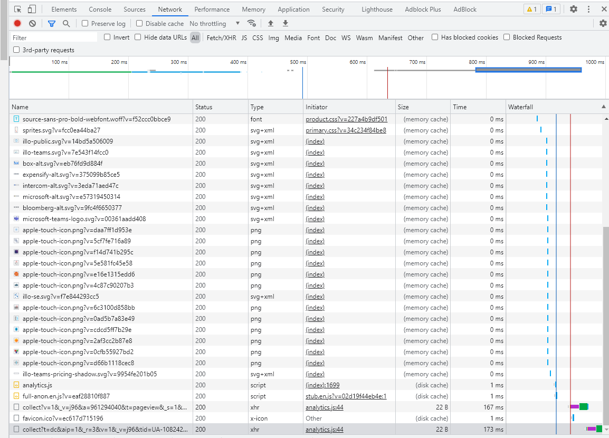
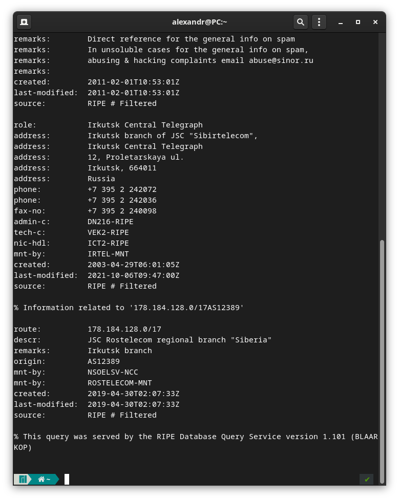
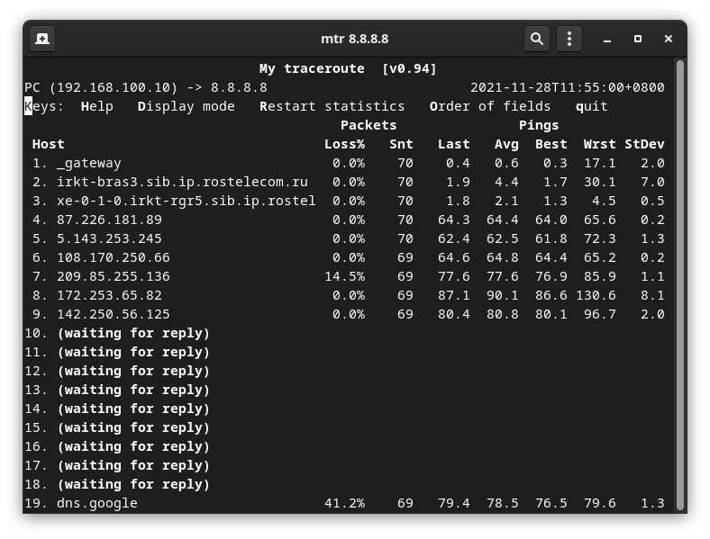
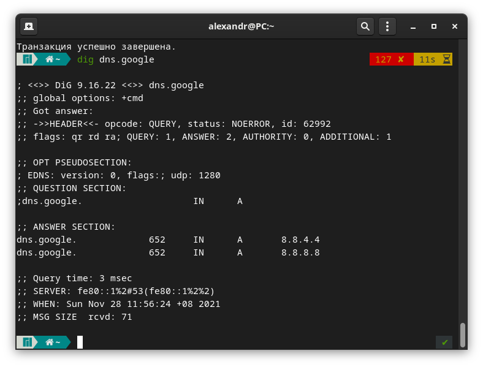
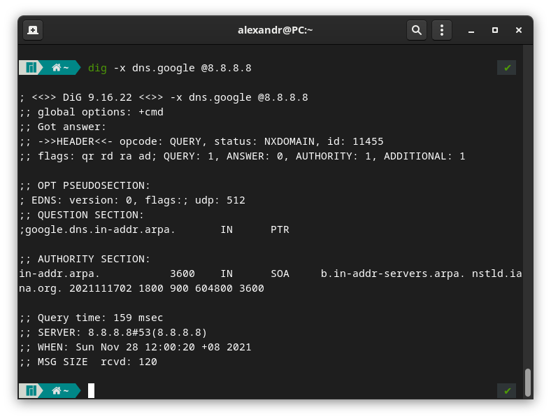

# Домашнее задание к занятию "3.6. Компьютерные сети, лекция 1"  

1. Работа c HTTP через телнет.  

    ```bash
        telnet stackoverflow.com 80                                     
        Trying 151.101.65.69...
        Connected to stackoverflow.com.
        Escape character is '^]'.
        GET /questions HTTP/1.0
        HOST: stackoverflow.com

        HTTP/1.1 301 Moved Permanently
        cache-control: no-cache, no-store, must-revalidate
        location: https://stackoverflow.com/questions
        x-request-guid: 0e500054-9986-4e7b-b9ad-e6b9947314ad
        feature-policy: microphone 'none'; speaker 'none'
        content-security-policy: upgrade-insecure-requests; frame-ancestors 'self' https://stackexchange.com
        Accept-Ranges: bytes
        Date: Thu, 25 Nov 2021 09:50:52 GMT
        Via: 1.1 varnish
        Connection: close
        X-Served-By: cache-fra19177-FRA
        X-Cache: MISS
        X-Cache-Hits: 0
        X-Timer: S1637833852.338031,VS0,VE92
        Vary: Fastly-SSL
        X-DNS-Prefetch-Control: off
        Set-Cookie: prov=31602ae4-ebbe-6c8b-2701-17a2218ae52b; domain=.stackoverflow.com; expires=Fri, 01-Jan-2055 00:00:00 GMT; path=/; HttpOnly

        Connection closed by foreign host.
    ```

    - HTTP/1.1 - Версия протокола http 
    - 301 Moved Permanently - Код состояния HTTP 301 или Moved Permanently — стандартный код ответа HTTP, получаемый в ответ от сервера в ситуации, когда запрошенный ресурс был на постоянной основе перемещён в новое месторасположение, и указывающий на то, что текущие ссылки, использующие данный URL, должны быть обновлены.
    - cache-control: no-cache, no-store, must-revalidate - Cache-Control используется для задания инструкций кеширования как для запросов, так и для ответов.
    - location: https://stackoverflow.com/questions - Поле заголовка HTTP Location возвращается в ответах от HTTP:
        - запросить веб-браузер загрузить другую веб-страницу (перенаправление URL ). В этом случае заголовок Location следует отправлять с кодом состояния HTTP 3xx. Он передается как часть ответа веб-сервером, когда запрошенный URI имеет:
        временно перемещен;
        перемещен навсегда; 
        или обработал запрос, например POST-форма и предоставляет результат этого запроса по другому URI
        - чтобы предоставить информацию о местоположении вновь созданного ресурса. В этом случае заголовок Location следует отправлять с кодом состояния HTTP 201 или 202.
    - 
    - feature-policy - Значение заголовка переопределяет политику браузера по умолчанию для данной страницы. К примеру, для блокировки микрофона и колонок по всему сайту: microphone 'none'; speaker 'none'
    - content-security-policy - политики безопастности. frame-ancestors: регламентирует способ встраивания данного документа в другие документы. Работает как заголовок X-Frame-Options, для замены которого, вероятно, и предназначен. Указатель upgrade-insecure-requests заставляет браузер волшебным образом переделать все HTTP-запросы в HTTPS-запросы.
    - Accept-Ranges: bytes - Accept-Ranges -- это маркер, который использует сервер, чтобы уведомить клиента о поддержке "запросов по кускам". Его значение указывает единицу измерения, которая может быть использована для определения диапазона чтения. Может быть 
        - Accept-Ranges: bytes
        - Accept-Ranges: none
    - Date: Thu, 25 Nov 2021 09:50:52 GMT дата и время формирования документа, по сути время когда был сгенерирован ответ на запрос.
    - Via: 1.1 varnish - закголовки серверного ПО, ничего не отображается, их скрыли для предотвращения атак.
    - Connection: close - Connection, Trailer, Upgrade, Proxy-Authorization и Proxy-Authenticate, любые «hop-by-hop» заголовки, используемые в сообщении, должны быть перечислены в заголовке Connection так, чтобы первый прокси знал, как их использовать, и не передавал дальше. Также могут быть перечислены стандартные «hop-by-hop» заголовки (часто это относится к Keep-Alive, но это необязательно).
    - X-Cache - Заголовок X-Cache добавляет Fastly (и другие CDN), вместе с другими специфичными хедерами, такими как X-Cache-Hits и X-Served-By. Когда отладка включена, то добавляется ещё больше, например, Fastly-Debug-Path и Fastly-Debug-TTL.
    - Vary - Заголовок ответа Vary определяет, как сопоставить будущие заголовки запроса, чтобы решить, можно ли использовать кешированный ответ, а не запрашивать новый с исходного сервера. Он используется сервером для указания того, какие заголовки он использовал при выборе представления ресурса в алгоритме согласования контента.
    - X-DNS-Prefetch-Control: off - В X-DNS-Prefetch-Control контролирует заголовок ответа HTTP DNS упреждающая выборка, функция , с помощью которого браузеры активно выполнять разрешение доменных имен на обеих ссылок , которые пользователь может выбрать , чтобы следовать, а также URL - адреса для элементов , упоминаемых в документе, в том числе изображений, CSS , JavaScript и так далее.
        - X-DNS-Prefetch-Control: on
        - X-DNS-Prefetch-Control: 
    - Set-Cookie - Куки обычно устанавливаются веб-сервером при помощи заголовка Set-Cookie. Затем браузер будет автоматически добавлять их в (почти) каждый запрос на тот же домен при помощи заголовка Cookie
    - Connection closed by foreign host. - Соединение закрыто внешним хостом     
 


1. Повторите задание 1 в браузере, используя консоль разработчика F12.    

    Состояние
    200
    OK

    
    


    

    дольше всего грузился скрипт analytics.js

    

1. Какой IP адрес у вас в интернете?

    Воспользовался сервисом https://2ip.ru/ 

    Из командной строки Linux можно отправить запрос `wget -qO- eth0.me`

1. Какому провайдеру принадлежит ваш IP адрес? Какой автономной системе AS? Воспользуйтесь утилитой `whois`  

    ```bash
     ~  wget -qO- eth0.me                                               
    178.184.164.203
     ~  whois -h whois.ripe.net 178.184.164.203                         
    % This is the RIPE Database query service.
    ...
    route:          178.184.128.0/17
    descr:          JSC Rostelecom regional branch "Siberia"
    remarks:        Irkutsk branch
    origin:         AS12389
    mnt-by:         NSOELSV-NCC
    mnt-by:         ROSTELECOM-MNT
    created:        2019-04-30T02:07:33Z
    last-modified:  2019-04-30T02:07:33Z
    source:         RIPE # Filtered
    ...

    ```

    

    ```bash
    ~  traceroute -An 178.184.164.203                                 
    traceroute to 178.184.164.203 (178.184.164.203), 30 hops max, 60 byte packets
    1  * 178.184.164.203 [AS12389]  0.568 ms  0.796 ms

    ```

    ```bash
    whois -h whois.ripe.net AS12389
    ```

1. Через какие сети проходит пакет, отправленный с вашего компьютера на адрес 8.8.8.8? Через какие AS? Воспользуйтесь утилитой `traceroute`  

    ```bash
    traceroute -An 8.8.8.8                                                           ✔ 
    traceroute to 8.8.8.8 (8.8.8.8), 30 hops max, 60 byte packets
    1  * 192.168.100.1 [*]  0.509 ms  0.703 ms
    2  213.228.116.150 [AS12389]  12.159 ms  12.245 ms  12.302 ms
    3  213.228.111.48 [AS12389]  5.089 ms 213.228.111.2 [AS12389]  4.980 ms 213.228.111.48 [AS12389]  5.130 ms
    4  87.226.181.89 [AS12389]  66.367 ms 87.226.183.89 [AS12389]  66.062 ms 87.226.181.89 [AS12389]  66.228 ms
    5  74.125.51.172 [AS15169]  65.318 ms 5.143.253.105 [AS12389]  65.973 ms  65.027 ms
    6  108.170.250.113 [AS15169]  114.956 ms 108.170.250.130 [AS15169]  64.753 ms 108.170.250.66 [AS15169]  65.860 ms
    7  * * 172.253.66.116 [AS15169]  76.016 ms
    8  72.14.238.168 [AS15169]  85.714 ms 74.125.253.94 [AS15169]  93.409 ms 108.170.235.64 [AS15169]  78.165 ms
    9  142.250.56.221 [AS15169]  84.117 ms 142.250.233.27 [AS15169]  83.316 ms 216.239.49.113 [AS15169]  79.576 ms
    10  * * *
    11  * * *
    12  * * *
    13  * * *
    14  * * *
    15  * * *
    16  * * *
    17  * * *
    18  * * *
    19  8.8.8.8 [AS15169]  74.379 ms  77.166 ms *
    ```
    - Через какие AS? 

    ```bash
    AS12389
    AS15169
    ```

1. Повторите задание 5 в утилите `mtr`. На каком участке наибольшая задержка - delay?  

    `mtr 8.8.8.8`
    ```bash
    8. 172.253.65.82                                                                                    0.0%    16   94.8  89.0  84.9 106.5   7.5

    ```

    


1. Какие DNS сервера отвечают за доменное имя `dns.google`? Какие `A` записи? воспользуйтесь утилитой `dig`  

    

    ```bash
    dns.google.		652	IN	A	8.8.4.4
    dns.google.		652	IN	A	8.8.8.8
    ```

1. Проверьте PTR записи для IP адресов из задания 7. Какое доменное имя привязано к IP? воспользуйтесь утилитой `dig` 

    `dig -х 8.8.8.8`, где ключ -х - для отображения обратной записи.  

    


    ```bash
    ;; ANSWER SECTION:
    8.8.8.8.in-addr.arpa.	10782	IN	PTR	dns.google.
    ```
    ```bash
    host -t soa dns.google                                                                          
    dns.google has SOA record ns1.zdns.google. dns-admin.google.com. 2684363368 21600 3600 1209600 300

    ```
    ```bash
    dig SOA dns.google
    ```

    `8.8.8.8` - `dns.google`
