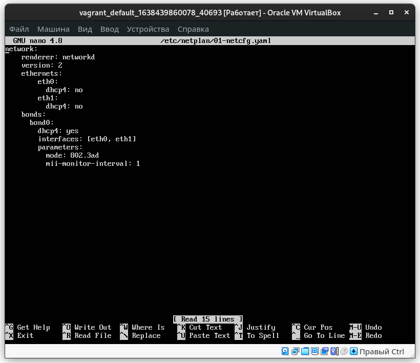
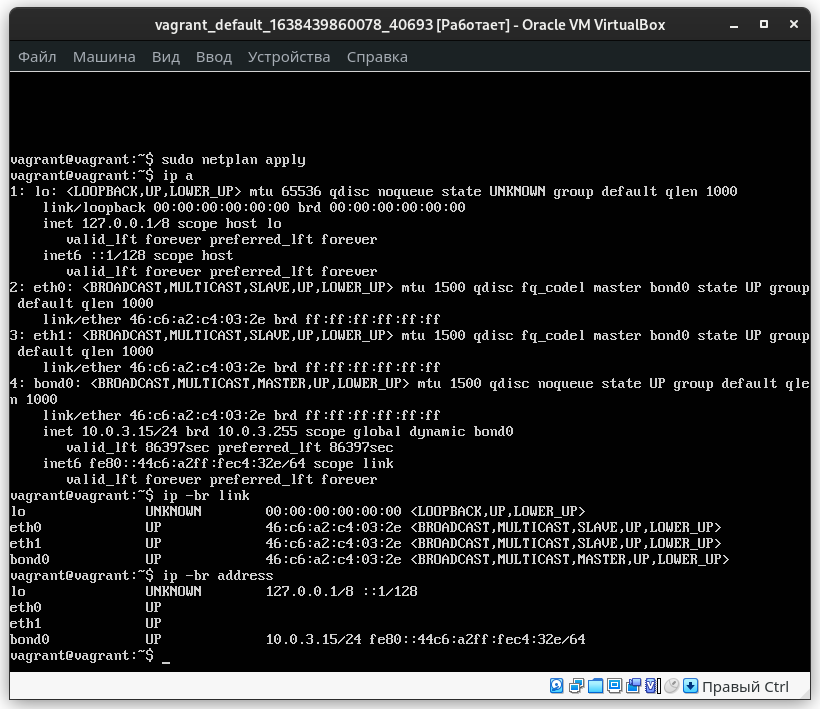
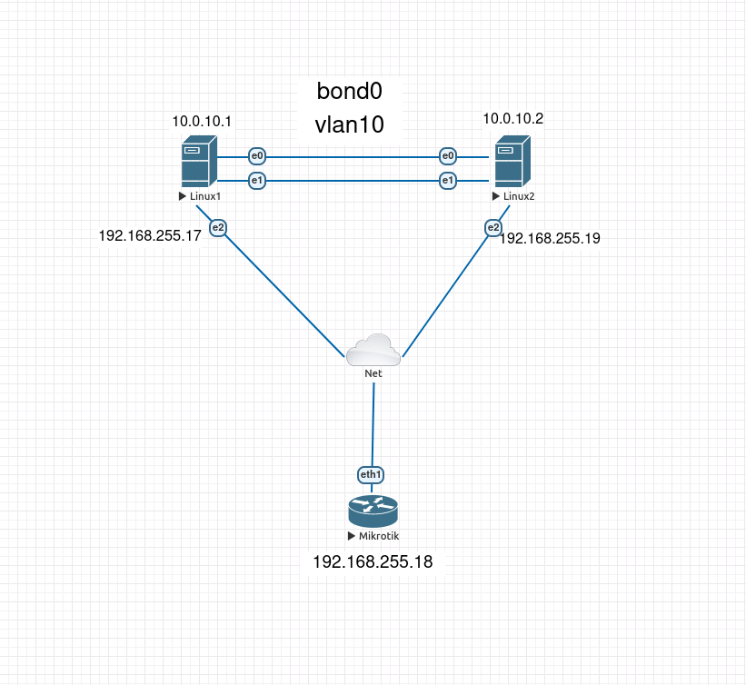
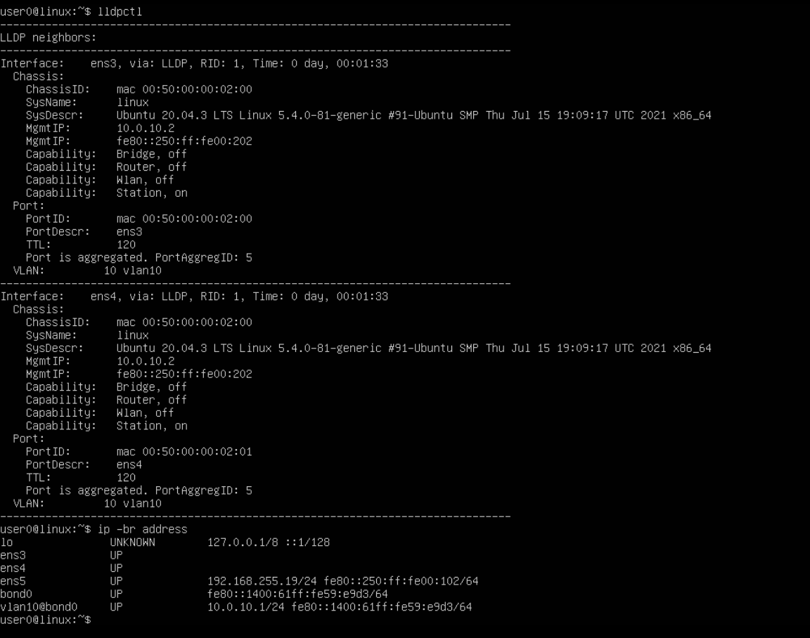
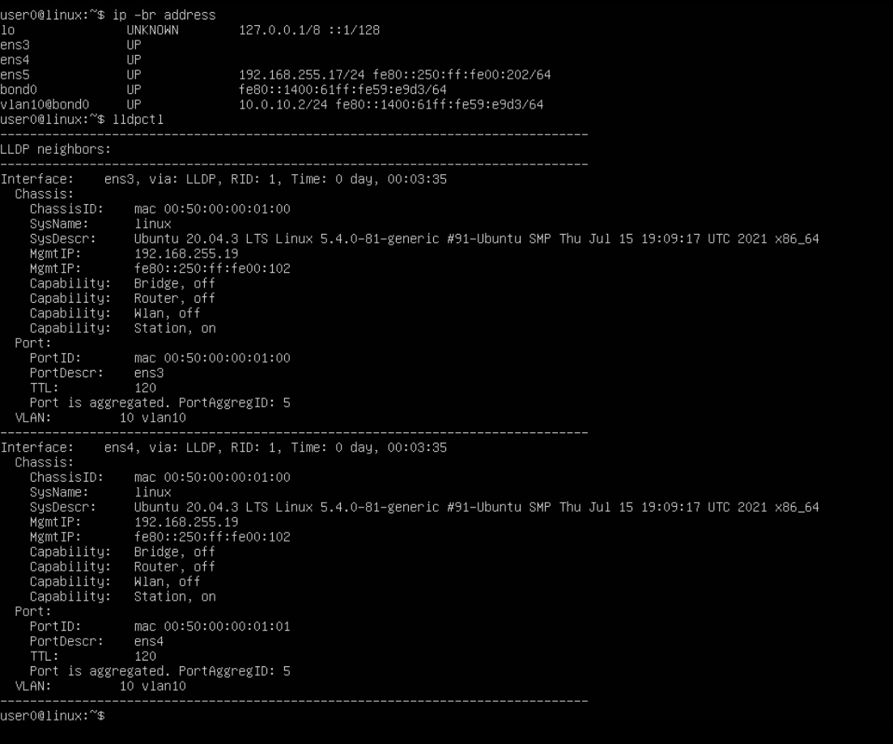
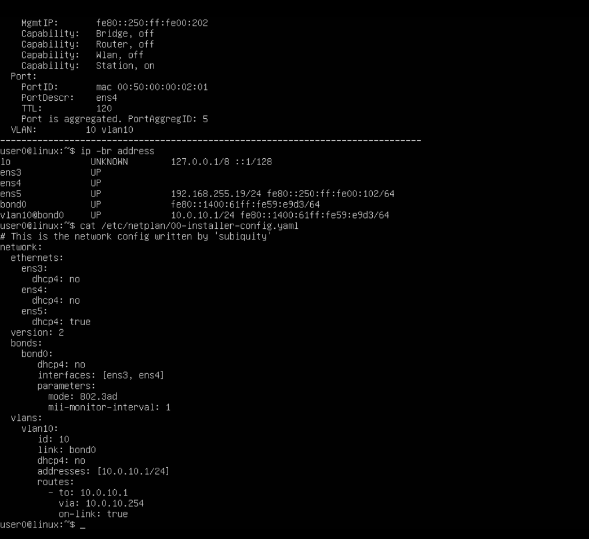
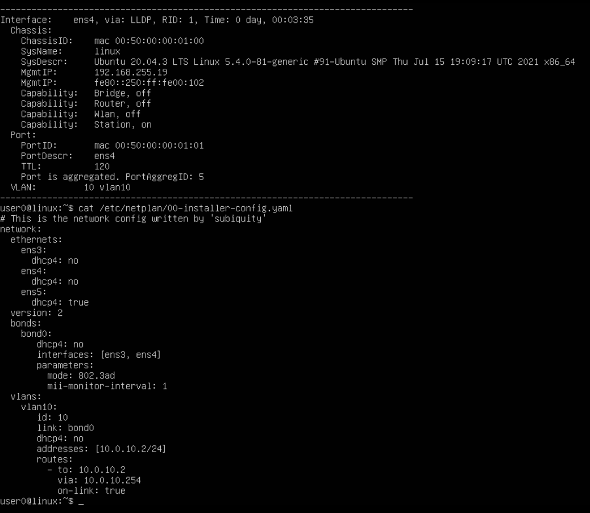

# Домашнее задание к занятию "3.7. Компьютерные сети, лекция 2"

1. Проверьте список доступных сетевых интерфейсов на вашем компьютере. Какие команды есть для этого в Linux и в Windows?

	- Windows
		- `ipconfig`
	- Linux
		- `ip a`
		- `ip -c -br link` (на Centos 6 у меня не сработал с ключём -с)
		- `ifconfig` (если установить пакет net-tools)

2. Какой протокол используется для распознавания соседа по сетевому интерфейсу? Какой пакет и команды есть в Linux для этого?

	- LLDP – протокол для обмена информацией между соседними устройствами, 
позволяет определить к какому порту коммутатора подключен сервер.

	- Пакет `lldpd`
	- Команда `lldpctl`

3. Какая технология используется для разделения L2 коммутатора на несколько виртуальных сетей? Какой пакет и команды есть в Linux для этого? Приведите пример конфига.

	- Технология `valn`

	- С помощью утилиты `vconfig` Считается устаревшим.
	`ip -br link` - проверил какие есть сеетвые интерфесы
	`sudo vconfig add eth0 10` - Создал vlan 10 на интерфейсе eth0
	```bash
	agrant@vagrant:~$ ip -br link
	lo               UNKNOWN        00:00:00:00:00:00 <LOOPBACK,UP,LOWER_UP> 
	eth0             UP             08:00:27:73:60:cf <BROADCAST,MULTICAST,UP,LOWER_UP> 
	vagrant@vagrant:~$ sudo vconfig add eth0 10

	Warning: vconfig is deprecated and might be removed in the future, please migrate to ip(route2) as soon as possible!

	vagrant@vagrant:~$ ip -br link
	lo               UNKNOWN        00:00:00:00:00:00 <LOOPBACK,UP,LOWER_UP> 
	eth0             UP             08:00:27:73:60:cf <BROADCAST,MULTICAST,UP,LOWER_UP> 
	eth0.10@eth0     DOWN           08:00:27:73:60:cf <BROADCAST,MULTICAST> 
	vagrant@vagrant:~$ 

	```

	- В до версии ubuntu 18 настройка vlan через конфигурационный файл `/etc/network/interfaces`


	```bash
	#vlan 20
	auto eth0.20
	iface eth0.20 inet static
	address 192.168.20.1
	netmask 255.255.255.0
	vlan-raw-device eth0
	```
	- С версии ubuntu 18 через `netplan` `/etc/netplan/01-netcfg.yaml`

	- `sudo nano /etc/netplan/01-netcfg.yaml` отредактировал файл
	- `sudo netplan apply` - перезапустил `netpaln`
	- `sudo netplan --debug apply` - дебаг

	```yaml
	network:
	version: 2
	renderer: networkd
	ethernets:
	    eth0:
        dhcp4: no
        addresses: [192.168.100.120/24]
	    gateway4: 192.168.100.1
	    nameservers:
	    addresses: [8.8.8.8,8.8.4.4]
	vlans:
	    vlan30:
	    id: 30
	    link: eth0
	    dhcp4: no
	    addresses: [192.168.30.12/24]
	    routes:
	          - to: 192.168.30.12/24
	            via: 192.168.30.1
	            on-link: true
	```

	- На redhat подобных надо создать файл `/etc/sysconfig/network-scripts/ifcfg-eth0.40`
	- `systemctl restart network` - перезапустить 
	```bash
	#vlan40
	DEVICE=eth0.40
	BOOTPROTO=none
	ONBOOT=yes
	IPADDR=192.168.40.10
	NETMASK=255.255.255.0
	USERCTL=no
	NETWORK=192.168.40.0
	VLAN=yes
	```


	- `lsmod | grep 8021q` - проверить что, модуль 8021q ядра Linux загружен.(у меня в ubuntu 20.04 был по умолчанию)


	```bash
	vagrant@vagrant:~$ lsmod | grep 8021q
	8021q                  32768  0
	garp                   16384  1 8021q
	mrp                    20480  1 8021q
	```


4. Какие типы агрегации интерфейсов есть в Linux? Какие опции есть для балансировки нагрузки? Приведите пример конфига.   

	- `bonding` Агрегация сетевых интерфейсов
		- Типы:
		- `balance-rr` - поочерёдное испольщзование интерфейсов про отправке пакетов
		- `active-backup` - Работает только один интерфейс, второй находится в резерве
		- `balance-xor` - Интерфейс определяет, через интерфейс отправить пакеты, в зависимости от MAC-адресов источника и получателя.
		- `broadcast` - Все пакеты отправляются через каждый интерфейс.
		- `802.3ad` - Реализует стандарты объединения каналов IEEE и обеспечивает как увеличение пропускной способности, так и отказоустойчивость.
		- `balance-tlb` - Распределение нагрузки при передаче. Входящий трафик обрабатывается в обычном режиме, а при передаче интерфейс определяется на основе данных о загруженности.
		- `balance-alb` - Адаптивное распределение нагрузки. Аналогично предыдущему режиму, но с возможностью балансировать также входящую нагрузку.  

	- бондинг в ubuntu после 18 версии где используется `netplan`

	```yaml
		network: 
		renderer: networkd 
		version: 2 
		ethernets: 
			eth0:
			dhcp4: no
			eth1:
			dhcp4: no
		bonds: 
		bond0:
			dhcp4: true
			interfaces: [eth0, eth1]
			parameters:
			mode: 802.3ad
			mii-monitor-interval: 1

	```

	

	

	- бондинг в ubuntu до 18 версии

		- `sudo nano /etc/network/interfaces`

		```bash
		# The primary network interface
		auto bond0
		iface bond0 inet static
			address 192.168.100.150
			netmask 255.255.255.0    
			gateway 192.168.100.1
			dns-nameservers 8.8.8.8
			dns-search domain.local
				slaves eth0 eth1
				bond_mode 0
				bond-miimon 100
				bond_downdelay 200
				bound_updelay 200
		```

		- На redhat подобных
			- В дирректории `/etc/sysconfig/network-scripts/` создать конфигурационный файл `ifcfg-bond0`
			```bash
			DEVICE=bond0
			IPADDR=192.168.100.100
			NETMASK=255.255.255.0
			ONBOOT=yes
			BOOTPROTO=none
			USERCTL=no
			```
			- В конфигурационных файлах сетевых интерфесов `ifcfg-eth0` и `ifcfg-eth1`
			- `ifcfg-eth0`
			```bash
			DEVICE=eth0
			USERCTL=no
			ONBOOT=yes
			MASTER=bond0
			SLAVE=yes
			BOOTPROTO=none
			```
			- `ifcfg-eth1`
			```bash
			DEVICE=eth1
			USERCTL=no
			ONBOOT=yes
			MASTER=bond0
			SLAVE=yes
			BOOTPROTO=none
			```


5. Сколько IP адресов в сети с маской /29 ? Сколько /29 подсетей можно получить из сети с маской /24. Приведите несколько примеров /29 подсетей внутри сети 10.10.10.0/24.   

	- `ipcalc 192.168.100.0/29`
	- 6 используемых адресов в маске /29

	- `ipcalc 192.168.0.1 255.255.255.0 255.255.255.248`
	- 32 подсети с маской /29 из сети с маской /24

	- `ipcalc 10.10.10.0 255.255.255.0 255.255.255.248`
	- ```bash
		Network:   10.10.10.8/29 
		HostMin:   10.10.10.9 
		HostMax:   10.10.10.14
		Broadcast: 10.10.10.15
		Hosts/Net: 6

		Network:   10.10.10.16/29
		HostMin:   10.10.10.17
		HostMax:   10.10.10.22
		Broadcast: 10.10.10.23
		Hosts/Net: 6


		Network:   10.10.10.24/29
		HostMin:   10.10.10.25
		HostMax:   10.10.10.30
		Broadcast: 10.10.10.31
		Hosts/Net: 6
	```

6. Задача: вас попросили организовать стык между 2-мя организациями. Диапазоны 10.0.0.0/8, 172.16.0.0/12, 192.168.0.0/16 уже заняты. Из какой подсети допустимо взять частные IP адреса? Маску выберите из расчета максимум 40-50 хостов внутри подсети.

	- можно использовать 100.64.0.0
	- маска /26 255.255.255.192 на назначаемых 62 хоста 
	- 100.64.0.0/26


7. Как проверить ARP таблицу в Linux, Windows? Как очистить ARP кеш полностью? Как из ARP таблицы удалить только один нужный IP?

	- Linux

		- `arp -a` проверить ARP таблицу
		- `ip neigh`
		- `sudo arp -d 192.168.100.9` удалить один хост из ARP таблицы
		- `sudo ip neigh flush all` очистить ARP кеш полностью

	- Windows

		- `arp -a` Проверить ARP таблицу
		- `arp -d` Очистить ARP таблицы
		- `arp -d 192.168.100.9` Удалить один хост из ARP таблицы

 ---
## Задание для самостоятельной отработки (необязательно к выполнению)

 8*. Установите эмулятор EVE-ng.
 
 Инструкция по установке - https://github.com/svmyasnikov/eve-ng

 Выполните задания на lldp, vlan, bonding в эмуляторе EVE-ng.






 ---
