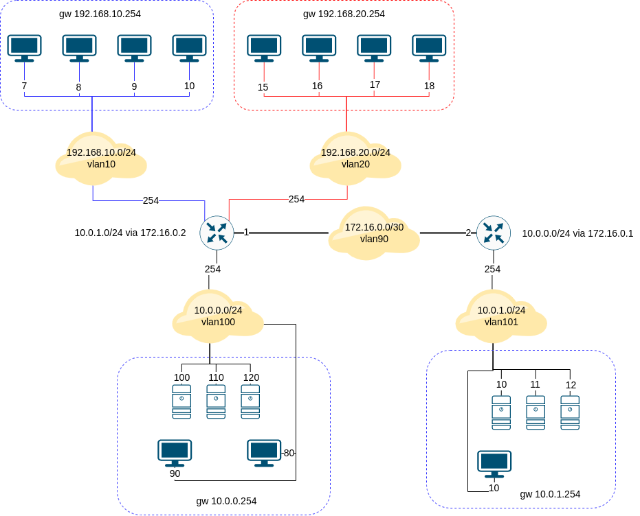
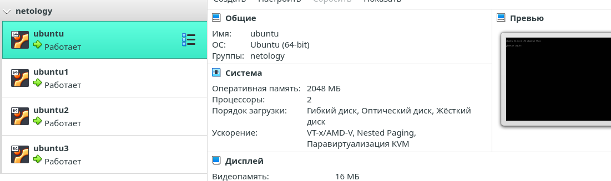
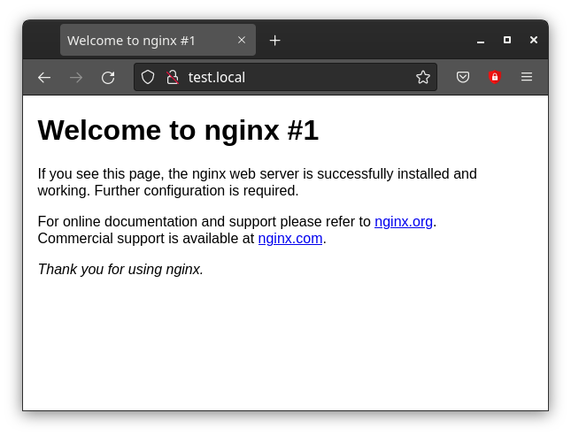
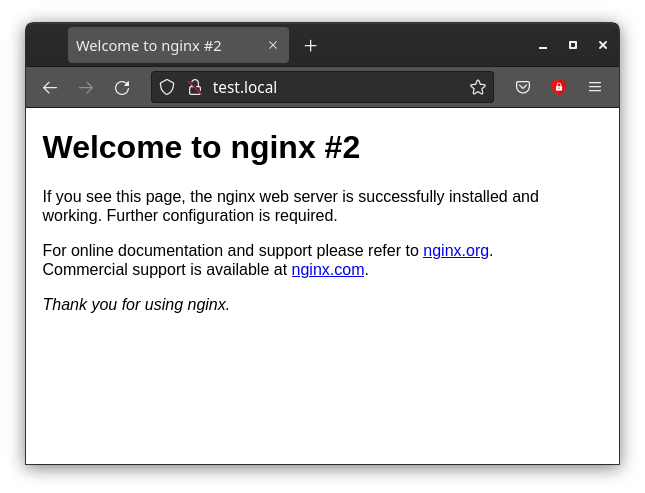

# Домашнее задание к занятию "3.8. Компьютерные сети, лекция 3"

1. Подключитесь к публичному маршрутизатору в интернет. Найдите маршрут к вашему публичному IP
```
telnet route-views.routeviews.org
Username: rviews
show ip route x.x.x.x/32
show bgp x.x.x.x/32
```
```
wget -qO- eth0.me                                             
176.48.153.82
```
```
telnet route-views.routeviews.org                              
Trying 128.223.51.103...
Connected to route-views.routeviews.org.
Escape character is '^]'.
C
**********************************************************************

                    RouteViews BGP Route Viewer
                    route-views.routeviews.org

 route views data is archived on http://archive.routeviews.org

 This hardware is part of a grant by the NSF.
 Please contact help@routeviews.org if you have questions, or
 if you wish to contribute your view.

 This router has views of full routing tables from several ASes.
 The list of peers is located at http://www.routeviews.org/peers
 in route-views.oregon-ix.net.txt

 NOTE: The hardware was upgraded in August 2014.  If you are seeing
 the error message, "no default Kerberos realm", you may want to
 in Mac OS X add "default unset autologin" to your ~/.telnetrc

 To login, use the username "rviews".

 **********************************************************************

User Access Verification

Username: rviews
```
```
route-views>show ip rou
route-views>show ip route 176.48.153.82   
Routing entry for 176.48.0.0/16
  Known via "bgp 6447", distance 20, metric 0
  Tag 6939, type external
  Last update from 64.71.137.241 4d22h ago
  Routing Descriptor Blocks:
  * 64.71.137.241, from 64.71.137.241, 4d22h ago
      Route metric is 0, traffic share count is 1
      AS Hops 2
      Route tag 6939
      MPLS label: none
```
```
route-views>show bgp 176.48.153.82
BGP routing table entry for 176.48.0.0/16, version 1388607812
Paths: (24 available, best #23, table default)
  Not advertised to any peer
  Refresh Epoch 1
  4901 6079 3356 12389
    162.250.137.254 from 162.250.137.254 (162.250.137.254)
      Origin IGP, localpref 100, valid, external
      Community: 65000:10100 65000:10300 65000:10400
      path 7FE0E255C920 RPKI State valid
      rx pathid: 0, tx pathid: 0
  Refresh Epoch 3
  3303 12389
    217.192.89.50 from 217.192.89.50 (138.187.128.158)
      Origin IGP, localpref 100, valid, external
      Community: 3303:1004 3303:1006 3303:1030 3303:3056
      path 7FE149911598 RPKI State valid
      rx pathid: 0, tx pathid: 0
...
...
...
  Refresh Epoch 1
  19214 174 3356 12389
    208.74.64.40 from 208.74.64.40 (208.74.64.40)
      Origin IGP, localpref 100, valid, external
      Community: 174:21000 174:22013
      path 7FE114EFC148 RPKI State valid
      rx pathid: 0, tx pathid: 0
route-views>  

```

2. Создайте dummy0 интерфейс в Ubuntu. Добавьте несколько статических маршрутов. Проверьте таблицу маршрутизации.  

Такие настроки сдействуют толко до перезагрузки, интерфейса и статических маршрутов не бутед после перезапуска.   

Добавляю интерфейс `dummy`  

`sudo ip link add dummy0 type dummy`  
`sudo ip link add dummy1 type dummy`  
`sudo ip link add dummy2 type dummy`  

```
vagrant@vagrant:~$ sudo ip link add dummy0 type dummy
vagrant@vagrant:~$ ip -c -br link
lo               UNKNOWN        00:00:00:00:00:00 <LOOPBACK,UP,LOWER_UP> 
eth0             UP             08:00:27:73:60:cf <BROADCAST,MULTICAST,UP,LOWER_UP> 
dummy0           DOWN           56:f8:ea:8d:88:01 <BROADCAST,NOARP> 
```
Проверяю маршруты  

```
vagrant@vagrant:~$ ip route show
default via 10.0.2.2 dev eth0 proto dhcp src 10.0.2.15 metric 100 
10.0.2.0/24 dev eth0 proto kernel scope link src 10.0.2.15 
```

Проверяю маршрут до сети 10.0.2.0/24  

```
vagrant@vagrant:~$ ip route show 10.0.2.0/24
10.0.2.0/24 dev eth0 proto kernel scope link src 10.0.2.15 
```
Добавляю статические маршруты:

`sudo ip route add 192.168.23.0/24 via 10.0.2.15` - Через шлюз  
`sudo ip route add 192.168.24.0/24 dev eth0` - Через интерфейс eth0  
`sudo ip route add 192.167.35.0/24 dev eth0 metric 100` - Через интерфейс eth0 с метрикой 100  

Проверяю статические маршруты `ip route show`  

```
vagrant@vagrant:~$ ip route show
default via 10.0.2.2 dev eth0 proto dhcp src 10.0.2.15 metric 100 
10.0.2.0/24 dev eth0 proto kernel scope link src 10.0.2.15 
10.0.2.2 dev eth0 proto dhcp scope link src 10.0.2.15 metric 100 
192.167.35.0/24 dev eth0 scope link metric 100 
192.168.23.0/24 via 10.0.2.15 dev eth0 
192.168.24.0/24 dev eth0 scope link 
```

- Статические маршруты в `netplan` в секции `routes`

```yaml
	network:
	version: 2
	renderer: networkd
	ethernets:
	    eth0:
        dhcp4: no
        addresses: [192.168.100.120/24]
	    gateway4: 192.168.100.1
	    nameservers:
	    addresses: [8.8.8.8,8.8.4.4]
        routes:
          - to: 10.0.0.0/24
            via: 192.168.1.1
```
- Ещё примеры статических маршрутов в `yaml` формате в `netplan`

```yaml
routes:
  - to: 10.0.0.0/24
    via: 10.24.0.1
  - to: 172.16.0.0/16
    via: 10.24.1.1
  - to: 192.168.12.0/24
    via: 192.168.10.254
```

3. Проверьте открытые TCP порты в Ubuntu, какие протоколы и приложения используют эти порты? Приведите несколько примеров.

- Пример вывода комманды `ss` с ключём `t` - tcp-соединения

```bash
user0@ubuntu0:~$ ss -t
State            Recv-Q            Send-Q                         Local Address:Port                         Peer Address:Port            Process           
ESTAB            0                 0                            192.168.100.120:ssh                        192.168.100.10:57882                             
```

- Пример вывода комманды `ss` с ключём `u` - udp-соединения (на момент проверки у меня таковых нет)

```bash
user0@ubuntu0:~$ ss -u
Recv-Q               Send-Q                             Local Address:Port                             Peer Address:Port              Process                                           
```
- Пример вывода комманды `ss` с ключём `t` и `a` - Cоединения ожидающие подключений(t - tcp)

```bash
user0@ubuntu0:~$ ss -t -a
State            Recv-Q           Send-Q                        Local Address:Port                           Peer Address:Port            Process           
LISTEN           0                4096                          127.0.0.53%lo:domain                              0.0.0.0:*                                 
LISTEN           0                128                                 0.0.0.0:ssh                                 0.0.0.0:*                                 
ESTAB            0                0                           192.168.100.120:ssh                          192.168.100.10:57882                             
LISTEN           0                128                                    [::]:ssh                                    [::]:*                                
```

- Проверил подключён ли конкретный ip к серверу.

```bash
user0@ubuntu0:~$ ss dst 192.168.100.10
Netid          State          Recv-Q          Send-Q                     Local Address:Port                     Peer Address:Port          Process          
tcp            ESTAB          0               0                        192.168.100.120:ssh                    192.168.100.10:57882                          

```
- `ss -tl` - Прослушиваемые tcp-соединения, `l` - показывает прослушиваемые сокеты, `t` — означает порт tcp

```bash
user0@ubuntu0:~$ ss -tl
State           Recv-Q          Send-Q                   Local Address:Port                     Peer Address:Port          Process          
LISTEN          0               4096                     127.0.0.53%lo:domain                        0.0.0.0:*                              
LISTEN          0               128                            0.0.0.0:ssh                           0.0.0.0:*                              
LISTEN          0               128                               [::]:ssh                              [::]:*                              
user0@ubuntu0:~$ 
```

 - `ss -lu` - Прослушиваемые udp-соединения, `u` - означает порт UDP.

```bash
user0@ubuntu0:~$ ss -lu
State       Recv-Q       Send-Q                                 Local Address:Port                      Peer Address:Port      Process      
UNCONN      0            0                                      127.0.0.53%lo:domain                         0.0.0.0:*                      
UNCONN      0            0                                          127.0.0.1:snmp                           0.0.0.0:*                      
UNCONN      0            0                                              [::1]:snmp                              [::]:*                      
UNCONN      0            0                  [fe80::a00:27ff:fe33:1103]%enp0s3:dhcpv6-client                     [::]:*                      
```

- `ss -lntup` tcp и udp соединения одновременно, `p` - выдает список имен процессов, которые открыли сокеты.

```bash
user0@ubuntu0:~$ ss -lntup
Netid      State       Recv-Q      Send-Q                                Local Address:Port             Peer Address:Port      Process      
udp        UNCONN      0           0                                     127.0.0.53%lo:53                    0.0.0.0:*                      
udp        UNCONN      0           0                                         127.0.0.1:161                   0.0.0.0:*                      
udp        UNCONN      0           0                                             [::1]:161                      [::]:*                      
udp        UNCONN      0           0                 [fe80::a00:27ff:fe33:1103]%enp0s3:546                      [::]:*                      
tcp        LISTEN      0           4096                                  127.0.0.53%lo:53                    0.0.0.0:*                      
tcp        LISTEN      0           128                                         0.0.0.0:22                    0.0.0.0:*                      
tcp        LISTEN      0           128                                            [::]:22                       [::]:*                      
```


4. Проверьте используемые UDP сокеты в Ubuntu, какие протоколы и приложения используют эти порты?


 - Воспользуюсь командой `ss -lnup`

```bash                    
user0@ubuntu0:~$ ss -lnup
State         Recv-Q        Send-Q                                   Local Address:Port               Peer Address:Port       Process       
UNCONN        0             0                                        127.0.0.53%lo:53                      0.0.0.0:*                        
UNCONN        0             0                                            127.0.0.1:161                     0.0.0.0:*                        
UNCONN        0             0                                                [::1]:161                        [::]:*                        
UNCONN        0             0                    [fe80::a00:27ff:fe33:1103]%enp0s3:546                        [::]:*                                      
```

- 53 udp порт `dns`   
- 161 порт `snmp`  
(в выводе присутствует ipv4 и ipv6)
- 546 dhcp ipv6  
(DHCPv6 использует UDP номер порта 546 для клиентов и номер порта 547 для серверов.)  

5. Используя diagrams.net, создайте L3 диаграмму вашей домашней сети или любой другой сети, с которой вы работали. 



 ---
## Задание для самостоятельной отработки (необязательно к выполнению)

6*. Установите Nginx, настройте в режиме балансировщика TCP или UDP.

`sudo nano /etc/hosts`  

192.168.100.120 test.local  

`sudo nano /etc/nginx/sites-available/test.local`  

```sh
upstream backend {
    server 192.168.100.121:80;
    server 192.168.100.122:80;
    server 192.168.100.123:80;
}

server {
    listen    80;
    server_name  test.local;
    location ~* \.()$ {
    root   /var/www/test.local;  }
    location / {
    client_max_body_size    10m;
    client_body_buffer_size 128k;
    proxy_send_timeout   90;
    proxy_read_timeout   90;
    proxy_buffer_size    4k;
    proxy_buffers     16 32k;
    proxy_busy_buffers_size 64k;
    proxy_temp_file_write_size 64k;
    proxy_connect_timeout 30s;
    proxy_pass   http://backend;
    proxy_set_header   Host   $host;
    proxy_set_header   X-Real-IP  $remote_addr;
    proxy_set_header   X-Forwarded-For $proxy_add_x_forwarded_for;
       }
location ~* /.(jpg|jpeg|gif|png|css|mp3|avi|mpg|txt|js|jar|rar|zip|tar|wav|wmv)$ {
root    /var/www/test.local;}
 }
```








7*. Установите bird2, настройте динамический протокол маршрутизации RIP.

8*. Установите Netbox, создайте несколько IP префиксов, используя curl проверьте работу API.

 ---
