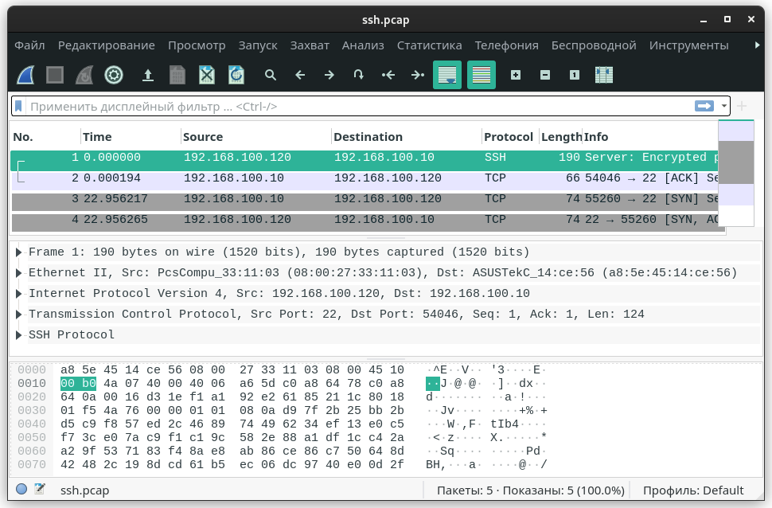

# Домашнее задание к занятию "3.9. Элементы безопасности информационных систем"

1. Установите Bitwarden плагин для браузера. Зарегестрируйтесь и сохраните несколько паролей.

Установил локальный сервер `bitwarden`  
в `/etc/hosts` прописал `192.168.100.9` `bitwarden.local`  


2. Установите Google authenticator на мобильный телефон. Настройте вход в Bitwarden акаунт через Google authenticator OTP.

Настроил двухфакторную авторизацию, приложение-аутентификатор (Google Authenticator)  


3. Установите apache2, сгенерируйте самоподписанный сертификат, настройте тестовый сайт для работы по HTTPS.


4. Проверьте на TLS уязвимости произвольный сайт в интернете (кроме сайтов МВД, ФСБ, МинОбр, НацБанк, РосКосмос, РосАтом, РосНАНО и любых госкомпаний, объектов КИИ, ВПК ... и тому подобное).

Запускал `testssl.sh` скачаный из репозитория `https://github.com/drwetter/testssl.sh.git`:  

`./testssl.sh -e --fast --parallel https://www.google.com/`  
`./testssl.sh -e --fast --parallel https://ya.ru/`  

```bash
###########################################################
    testssl.sh       3.1dev from https://testssl.sh/dev/
    (2dce751 2021-12-09 17:03:57 -- )

      This program is free software. Distribution and
             modification under GPLv2 permitted.
      USAGE w/o ANY WARRANTY. USE IT AT YOUR OWN RISK!

       Please file bugs @ https://testssl.sh/bugs/

###########################################################

 Using "OpenSSL 1.0.2-chacha (1.0.2k-dev)" [~183 ciphers]
 on PC:./bin/openssl.Linux.x86_64
 (built: "Jan 18 17:12:17 2019", platform: "linux-x86_64")


 Start 2021-12-10 20:48:30        -->> 87.250.250.242:443 (ya.ru) <<--

 Further IP addresses:   2a02:6b8::2:242 
 rDNS (87.250.250.242):  ya.ru.
 Service detected:       HTTP


 Testing all 183 locally available ciphers against the server, ordered by encryption strength 


Hexcode  Cipher Suite Name (OpenSSL)       KeyExch.   Encryption  Bits     Cipher Suite Name (IANA/RFC)
-----------------------------------------------------------------------------------------------------------------------------
 xc030   ECDHE-RSA-AES256-GCM-SHA384       ECDH 256   AESGCM      256      TLS_ECDHE_RSA_WITH_AES_256_GCM_SHA384              
 xc02c   ECDHE-ECDSA-AES256-GCM-SHA384     ECDH 256   AESGCM      256      TLS_ECDHE_ECDSA_WITH_AES_256_GCM_SHA384            
 xc02f   ECDHE-RSA-AES128-GCM-SHA256       ECDH 256   AESGCM      128      TLS_ECDHE_RSA_WITH_AES_128_GCM_SHA256              
 xc02b   ECDHE-ECDSA-AES128-GCM-SHA256     ECDH 256   AESGCM      128      TLS_ECDHE_ECDSA_WITH_AES_128_GCM_SHA256            
 xc027   ECDHE-RSA-AES128-SHA256           ECDH 256   AES         128      TLS_ECDHE_RSA_WITH_AES_128_CBC_SHA256              
 xc023   ECDHE-ECDSA-AES128-SHA256         ECDH 256   AES         128      TLS_ECDHE_ECDSA_WITH_AES_128_CBC_SHA256            
 xc013   ECDHE-RSA-AES128-SHA              ECDH 256   AES         128      TLS_ECDHE_RSA_WITH_AES_128_CBC_SHA                 
 x9c     AES128-GCM-SHA256                 RSA        AESGCM      128      TLS_RSA_WITH_AES_128_GCM_SHA256                    
 x3c     AES128-SHA256                     RSA        AES         128      TLS_RSA_WITH_AES_128_CBC_SHA256                    
 x2f     AES128-SHA                        RSA        AES         128      TLS_RSA_WITH_AES_128_CBC_SHA                       
 x0a     DES-CBC3-SHA                      RSA        3DES        168      TLS_RSA_WITH_3DES_EDE_CBC_SHA                      


 Done 2021-12-10 20:48:37 [   9s] -->> 87.250.250.242:443 (ya.ru) <<--

```

Просканировал тестовый сайт scanme.nmap.org утилитой `nmap`  

`sudo nmap -A scanme.nmap.org`

```bash
Starting Nmap 7.92 ( https://nmap.org ) at 2021-12-10 20:50 +08
Nmap scan report for scanme.nmap.org (45.33.32.156)
Host is up (0.26s latency).
Other addresses for scanme.nmap.org (not scanned): 2600:3c01::f03c:91ff:fe18:bb2f
Not shown: 996 closed tcp ports (reset)
PORT      STATE SERVICE    VERSION
22/tcp    open  ssh        OpenSSH 6.6.1p1 Ubuntu 2ubuntu2.13 (Ubuntu Linux; protocol 2.0)
| ssh-hostkey: 
|   1024 ac:00:a0:1a:82:ff:cc:55:99:dc:67:2b:34:97:6b:75 (DSA)
|   2048 20:3d:2d:44:62:2a:b0:5a:9d:b5:b3:05:14:c2:a6:b2 (RSA)
|   256 96:02:bb:5e:57:54:1c:4e:45:2f:56:4c:4a:24:b2:57 (ECDSA)
|_  256 33:fa:91:0f:e0:e1:7b:1f:6d:05:a2:b0:f1:54:41:56 (ED25519)
80/tcp    open  http       Apache httpd 2.4.7 ((Ubuntu))
|_http-favicon: Nmap Project
|_http-title: Go ahead and ScanMe!
|_http-server-header: Apache/2.4.7 (Ubuntu)
9929/tcp  open  nping-echo Nping echo
31337/tcp open  tcpwrapped
Aggressive OS guesses: Linux 5.0 (95%), Linux 5.0 - 5.4 (95%), Linux 5.4 (94%), HP P2000 G3 NAS device (93%), Linux 4.15 - 5.6 (93%), Linux 5.3 - 5.4 (93%), Linux 2.6.32 (92%), Infomir MAG-250 set-top box (92%), Linux 5.0 - 5.3 (92%), Linux 5.1 (92%)
No exact OS matches for host (test conditions non-ideal).
Network Distance: 13 hops
Service Info: OS: Linux; CPE: cpe:/o:linux:linux_kernel

TRACEROUTE (using port 5900/tcp)
HOP RTT       ADDRESS
1   0.28 ms   192.168.100.1
2   18.16 ms  irkt-bras3.sib.ip.rostelecom.ru (213.228.116.150)
3   16.46 ms  xe-0-1-0.irkt-rgr5.sib.ip.rostelecom.ru (213.228.111.2)
4   39.50 ms  95.167.93.75
5   122.81 ms 217.161.68.34
6   121.73 ms 217.161.68.33
7   259.03 ms ae15-pcr1.ptl.cw.net (195.2.9.126)
8   254.90 ms et-7-1-0-xcr1.nyh.cw.net (195.2.24.241)
9   213.32 ms xe-0-2-1-xcr1.chg.cw.net (195.2.28.34)
10  253.82 ms ae1-xcr1.sje.cw.net (195.2.24.97)
11  270.31 ms linode-gw-xcr1.sje.cw.net (195.2.14.206)
12  248.55 ms if-2-6.csw5-fnc1.linode.com (173.230.159.71)
13  256.81 ms scanme.nmap.org (45.33.32.156)

OS and Service detection performed. Please report any incorrect results at https://nmap.org/submit/ .
Nmap done: 1 IP address (1 host up) scanned in 27.20 seconds

```

5. Установите на Ubuntu ssh сервер, сгенерируйте новый приватный ключ. Скопируйте свой публичный ключ на другой сервер. Подключитесь к серверу по SSH-ключу.

Есть группа виртуальных машин:  


192.168.100.120 - ubuntu0   
192.168.100.121 - ubuntu1  
192.168.100.122 - ubuntu2  
192.168.100.123 - ubuntu3

в предыдущем задании [03-sysadmin-08-net 6*](https://github.com/gaoroot/DevOps-netology/tree/main/03-sysadmin-08-net#%D0%B7%D0%B0%D0%B4%D0%B0%D0%BD%D0%B8%D0%B5-%D0%B4%D0%BB%D1%8F-%D1%81%D0%B0%D0%BC%D0%BE%D1%81%D1%82%D0%BE%D1%8F%D1%82%D0%B5%D0%BB%D1%8C%D0%BD%D0%BE%D0%B9-%D0%BE%D1%82%D1%80%D0%B0%D0%B1%D0%BE%D1%82%D0%BA%D0%B8-%D0%BD%D0%B5%D0%BE%D0%B1%D1%8F%D0%B7%D0%B0%D1%82%D0%B5%D0%BB%D1%8C%D0%BD%D0%BE-%D0%BA-%D0%B2%D1%8B%D0%BF%D0%BE%D0%BB%D0%BD%D0%B5%D0%BD%D0%B8%D1%8E) настраивал `nginx` как балансировщик нагрузки и делал доступ с `192.168.100.120` до хостов `121, 122, 123` по `ssh` без пароля    

Выполнял команды на 192.168.100.120:  

`ssh-keygen`  
`ssh-copy-id user0@192.168.100.121`   
`ssh-copy-id user0@192.168.100.122`   
`ssh-copy-id user0@192.168.100.123`   

После чего подключался `ssh user0@192.168.100.121`  


6. Переименуйте файлы ключей из задания 5. Настройте файл конфигурации SSH клиента, так чтобы вход на удаленный сервер осуществлялся по имени сервера.

  


7. Соберите дамп трафика утилитой tcpdump в формате pcap, 100 пакетов. Откройте файл pcap в Wireshark.

Cмотрю список интерфейсов через утилиту `tcpdump` командо й `tcpdump --list-interfaces`  

```bash
user0@ubuntu0:~$ tcpdump --list-interfaces
1.enp0s3 [Up, Running]
2.lo [Up, Running, Loopback]
3.any (Pseudo-device that captures on all interfaces) [Up, Running]
4.docker0 [Up]
5.bluetooth-monitor (Bluetooth Linux Monitor) [none]
6.nflog (Linux netfilter log (NFLOG) interface) [none]
7.nfqueue (Linux netfilter queue (NFQUEUE) interface) [none]

```

Дамп `ssh-трафика` - `sudo tcpdump -c 5 -i enp0s3 port 22 -w ssh.pcap`  

```bash
user0@ubuntu0:~$ sudo tcpdump -c 5 -i enp0s3 port 22 -w ssh.pcap
tcpdump: listening on enp0s3, link-type EN10MB (Ethernet), capture size 262144 bytes
5 packets captured
45 packets received by filter
0 packets dropped by kernel

```



 ---
## Задание для самостоятельной отработки (необязательно к выполнению)

8*. Просканируйте хост scanme.nmap.org. Какие сервисы запущены?


9*. Установите и настройте фаервол ufw на web-сервер из задания 3. Откройте доступ снаружи только к портам 22,80,443

```bash
user0@ubuntu0:~$ sudo ufw status verbose
Status: active
Logging: on (low)
Default: deny (incoming), allow (outgoing), deny (routed)
New profiles: skip

To                         Action      From
--                         ------      ----
80/tcp (Nginx HTTP)        ALLOW IN    Anywhere                  
22/tcp                     ALLOW IN    Anywhere                  
80/tcp (Nginx HTTP (v6))   ALLOW IN    Anywhere (v6)             
22/tcp (v6)                ALLOW IN    Anywhere (v6)             

user0@ubuntu0:~$ sudo ufw app list
Available applications:
  CUPS
  Nginx Full
  Nginx HTTP
  Nginx HTTPS
  OpenSSH
user0@ubuntu0:~$ sudo ufw allow https
Rule added
Rule added (v6)
user0@ubuntu0:~$ sudo ufw app list
Available applications:
  CUPS
  Nginx Full
  Nginx HTTP
  Nginx HTTPS
  OpenSSH
user0@ubuntu0:~$ sudo ufw status verbose
Status: active
Logging: on (low)
Default: deny (incoming), allow (outgoing), deny (routed)
New profiles: skip

To                         Action      From
--                         ------      ----
80/tcp (Nginx HTTP)        ALLOW IN    Anywhere                  
22/tcp                     ALLOW IN    Anywhere                  
443/tcp                    ALLOW IN    Anywhere                  
80/tcp (Nginx HTTP (v6))   ALLOW IN    Anywhere (v6)             
22/tcp (v6)                ALLOW IN    Anywhere (v6)             
443/tcp (v6)               ALLOW IN    Anywhere (v6)             


```

 ---