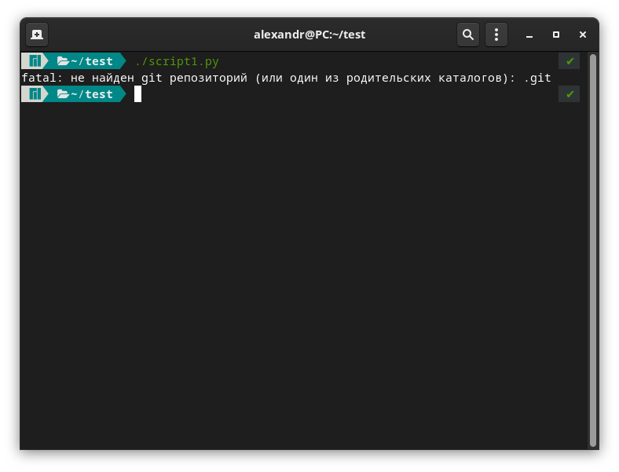
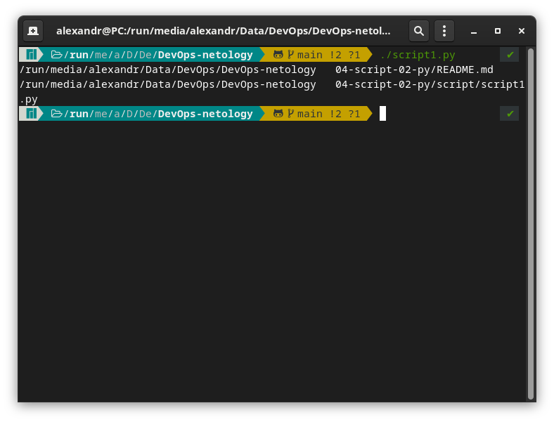
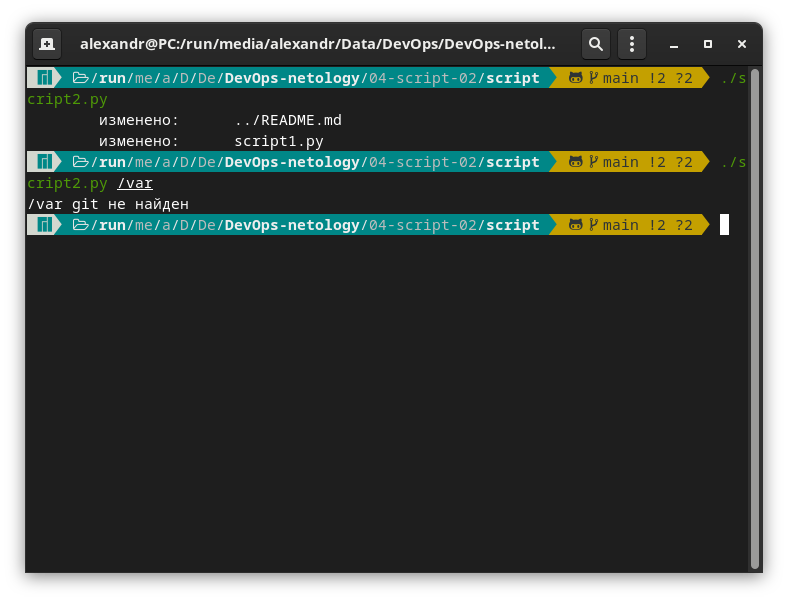

# Домашнее задание к занятию "4.2. Использование Python для решения типовых DevOps задач"

## Обязательная задача 1

Есть скрипт:
```python
#!/usr/bin/env python3
a = 1
b = '2'
c = a + b
```


```python
#!/usr/bin/env python3

a = 1
b = 2
c = a + b
print(c)
```
c = 3  

```python
#!/usr/bin/env python3

a = '1'
b = '2'
c = a + b
print(c)
```
c = 12  

### Вопросы:
| Вопрос  | Ответ |
| ------------- | ------------- |
| Какое значение будет присвоено переменной `c`?  | TypeError: unsupported operand type(s) for +: 'int' and 'str'  |
| Как получить для переменной `c` значение 12?  | a = '1'  b = '2' |
| Как получить для переменной `c` значение 3?  | a = 1  b = 2  |

## Обязательная задача 2
Мы устроились на работу в компанию, где раньше уже был DevOps Engineer. Он написал скрипт, позволяющий узнать, какие файлы модифицированы в репозитории, относительно локальных изменений. Этим скриптом недовольно начальство, потому что в его выводе есть не все изменённые файлы, а также непонятен полный путь к директории, где они находятся. Как можно доработать скрипт ниже, чтобы он исполнял требования вашего руководителя?

```python
#!/usr/bin/env python3

import os

bash_command = ["cd ~/netology/sysadm-homeworks", "git status"]
result_os = os.popen(' && '.join(bash_command)).read()
is_change = False
for result in result_os.split('\n'):
    if result.find('modified') != -1:
        prepare_result = result.replace('\tmodified:   ', '')
        print(prepare_result)
        break
```

### Ваш скрипт:
```python
#!/usr/bin/env python3

import os

cmd = os.getcwd()
bash_command = ["cd "+cmd, "git status"]
result_os = os.popen(' && '.join(bash_command)).read()
for result in result_os.split('\n'):
    if result.find('изменено') != -1:
        prepare_result = result.replace('\tизменено:   ', '')
        print(cmd+prepare_result)
```

### Вывод скрипта при запуске при тестировании:
- В каталоге без git

```
    ~/test  ./script1.py                                                ✔ 
fatal: не найден git репозиторий (или один из родительских каталогов): .git
```



- В каталоге с git

```
    /run/me/a/D/De/DevOps-netology    main !2 ?1  ./script1.py       ✔ 
/run/media/alexandr/Data/DevOps/DevOps-netology   04-script-02-py/README.md
/run/media/alexandr/Data/DevOps/DevOps-netology   04-script-02-py/script/script1.py
```


## Обязательная задача 3
1. Доработать скрипт выше так, чтобы он мог проверять не только локальный репозиторий в текущей директории, а также умел воспринимать путь к репозиторию, который мы передаём как входной параметр. Мы точно знаем, что начальство коварное и будет проверять работу этого скрипта в директориях, которые не являются локальными репозиториями.

### Ваш скрипт:
```python
#!/usr/bin/env python3

import os
import sys


cmd = os.getcwd()

if len(sys.argv)>=2:
    cmd = sys.argv[1]
bash_command = ["cd "+cmd, "git status 2>&1"]
result_os = os.popen(' && '.join(bash_command)).read()
for result in result_os.split('\n'):
    if result.find('fatal') != -1:
        print(cmd+" git не найден")
    if result.find('изменено') != -1:
        prepare_result = result.replace('\изменено:   ', '')
        print(prepare_result)
```

### Вывод скрипта при запуске при тестировании:
```
~ /bin/python /run/media/alexandr/Data/DevOps/DevOps-netology/04-script-02-py/script/script2.py
/home/alexandr git не найден
~ /bin/python /run/media/alexandr/Data/DevOps/DevOps-netology/04-script-02-py/script/script2.py /run/media/alexandr/Data/DevOps/DevOps-netology
        изменено:      04-script-02-py/README.md
        изменено:      04-script-02-py/script/script2.py
```



## Обязательная задача 4
1. Наша команда разрабатывает несколько веб-сервисов, доступных по http. Мы точно знаем, что на их стенде нет никакой балансировки, кластеризации, за DNS прячется конкретный IP сервера, где установлен сервис. Проблема в том, что отдел, занимающийся нашей инфраструктурой очень часто меняет нам сервера, поэтому IP меняются примерно раз в неделю, при этом сервисы сохраняют за собой DNS имена. Это бы совсем никого не беспокоило, если бы несколько раз сервера не уезжали в такой сегмент сети нашей компании, который недоступен для разработчиков. Мы хотим написать скрипт, который опрашивает веб-сервисы, получает их IP, выводит информацию в стандартный вывод в виде: <URL сервиса> - <его IP>. Также, должна быть реализована возможность проверки текущего IP сервиса c его IP из предыдущей проверки. Если проверка будет провалена - оповестить об этом в стандартный вывод сообщением: [ERROR] <URL сервиса> IP mismatch: <старый IP> <Новый IP>. Будем считать, что наша разработка реализовала сервисы: `drive.google.com`, `mail.google.com`, `google.com`.

### Ваш скрипт:
```python
#!/usr/bin/env python3

import socket
import time

servers = {"drive.google.com": "", "mail.google.com": "", "google.com": ""}
while True:
    for url, ip in servers.items():
        ip_addr = socket.gethostbyname(url)
        if ip == "":
            servers[url] = ip_addr
            print("{} - {}".format(url, ip_addr))
        elif ip != ip_addr:
            print("[ERROR] {} IP mismatch: {} -> {}".format(url, ip, ip_addr))
            servers[url] = ip_addr
    time.sleep(1)
```
### Вывод скрипта при запуске при тестировании:
```
drive.google.com - 173.194.220.194
mail.google.com - 64.233.162.19
google.com - 173.194.222.113
[ERROR] drive.google.com IP mismatch: 173.194.220.194 -> 142.250.150.194
[ERROR] google.com IP mismatch: 173.194.222.113 -> 209.85.233.139
[ERROR] drive.google.com IP mismatch: 142.250.150.194 -> 74.125.131.194
[ERROR] google.com IP mismatch: 209.85.233.139 -> 74.125.131.101
[ERROR] drive.google.com IP mismatch: 74.125.131.194 -> 142.250.150.194
[ERROR] mail.google.com IP mismatch: 64.233.162.19 -> 74.125.131.83
[ERROR] google.com IP mismatch: 74.125.131.101 -> 209.85.233.139
[ERROR] drive.google.com IP mismatch: 142.250.150.194 -> 74.125.131.194
[ERROR] google.com IP mismatch: 209.85.233.139 -> 74.125.131.101
[ERROR] mail.google.com IP mismatch: 74.125.131.83 -> 64.233.161.19
[ERROR] google.com IP mismatch: 74.125.131.101 -> 64.233.165.101
[ERROR] drive.google.com IP mismatch: 74.125.131.194 -> 173.194.220.194
[ERROR] drive.google.com IP mismatch: 173.194.220.194 -> 142.250.150.194
[ERROR] google.com IP mismatch: 64.233.165.101 -> 209.85.233.139
```

## Дополнительное задание (со звездочкой*) - необязательно к выполнению

Так получилось, что мы очень часто вносим правки в конфигурацию своей системы прямо на сервере. Но так как вся наша команда разработки держит файлы конфигурации в github и пользуется gitflow, то нам приходится каждый раз переносить архив с нашими изменениями с сервера на наш локальный компьютер, формировать новую ветку, коммитить в неё изменения, создавать pull request (PR) и только после выполнения Merge мы наконец можем официально подтвердить, что новая конфигурация применена. Мы хотим максимально автоматизировать всю цепочку действий. Для этого нам нужно написать скрипт, который будет в директории с локальным репозиторием обращаться по API к github, создавать PR для вливания текущей выбранной ветки в master с сообщением, которое мы вписываем в первый параметр при обращении к py-файлу (сообщение не может быть пустым). При желании, можно добавить к указанному функционалу создание новой ветки, commit и push в неё изменений конфигурации. С директорией локального репозитория можно делать всё, что угодно. Также, принимаем во внимание, что Merge Conflict у нас отсутствуют и их точно не будет при push, как в свою ветку, так и при слиянии в master. Важно получить конечный результат с созданным PR, в котором применяются наши изменения. 

### Ваш скрипт:
```python
???
```

### Вывод скрипта при запуске при тестировании:
```
???
```
