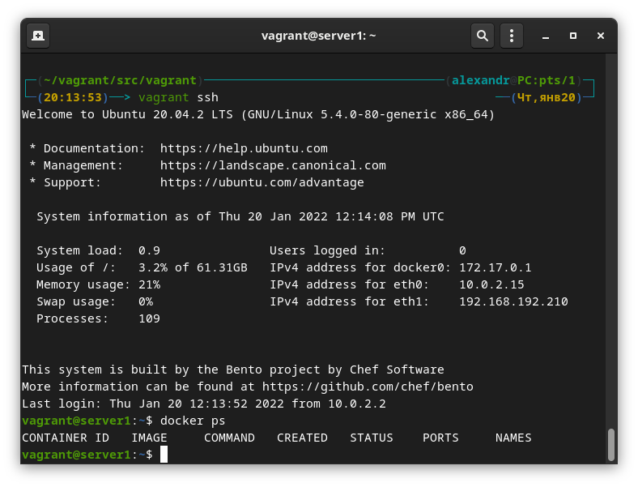

# Домашнее задание к занятию "5.2. Применение принципов IaaC в работе с виртуальными машинами"

## Задача 1

- Опишите своими словами основные преимущества применения на практике IaaC паттернов.
- Какой из принципов IaaC является основополагающим?

## Задача 2

- Чем Ansible выгодно отличается от других систем управление конфигурациями?
- Какой, на ваш взгляд, метод работы систем конфигурации более надёжный push или pull?

## Задача 3

Установить на личный компьютер:

- VirtualBox  
    ```
    vboxmanage --version

    6.1.30r148432
    ```
- Vagrant
    ```
    vagrant --version

    Vagrant 2.2.19
    ```
- Ansible
    ```
    ansible --version

    ansible [core 2.12.1]
    config file = /etc/ansible/ansible.cfg
    configured module search path = ['/home/alexandr/.ansible/plugins/modules', '/usr/share/ansible/plugins/modules']
    ansible python module location = /usr/lib/python3.10/site-packages/ansible
    ansible collection location = /home/alexandr/.ansible/collections:/usr/share/ansible/collections
    executable location = /usr/bin/ansible
    python version = 3.10.1 (main, Dec 18 2021, 23:53:45) [GCC 11.1.0]
    jinja version = 3.0.3
    libyaml = True
    ```


## Задача 4 (*)

Воспроизвести практическую часть лекции самостоятельно.

- Создать виртуальную машину.
- Зайти внутрь ВМ, убедиться, что Docker установлен с помощью команды
```
docker ps
```
