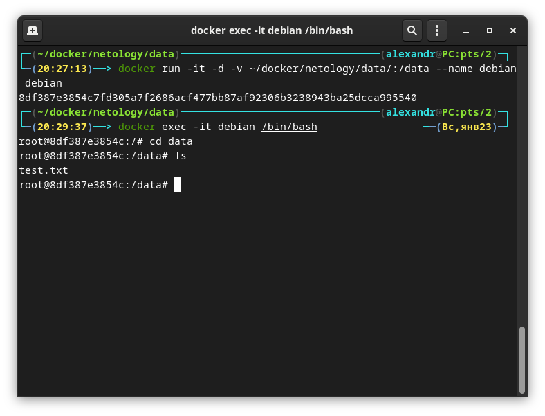
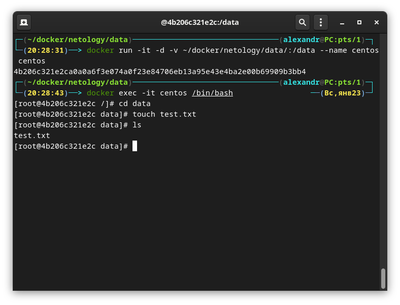
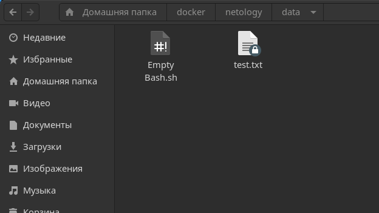
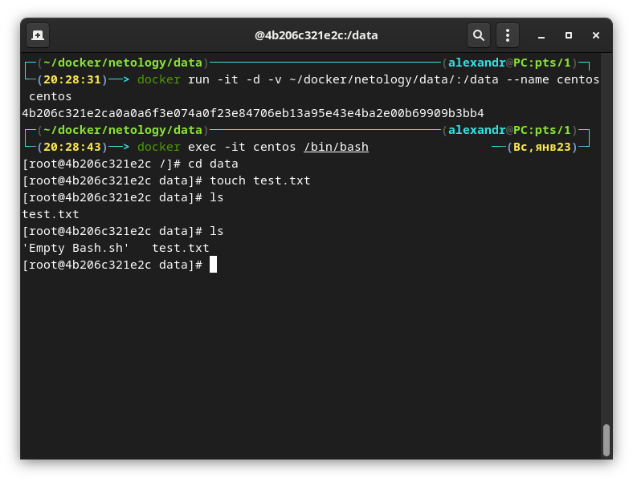
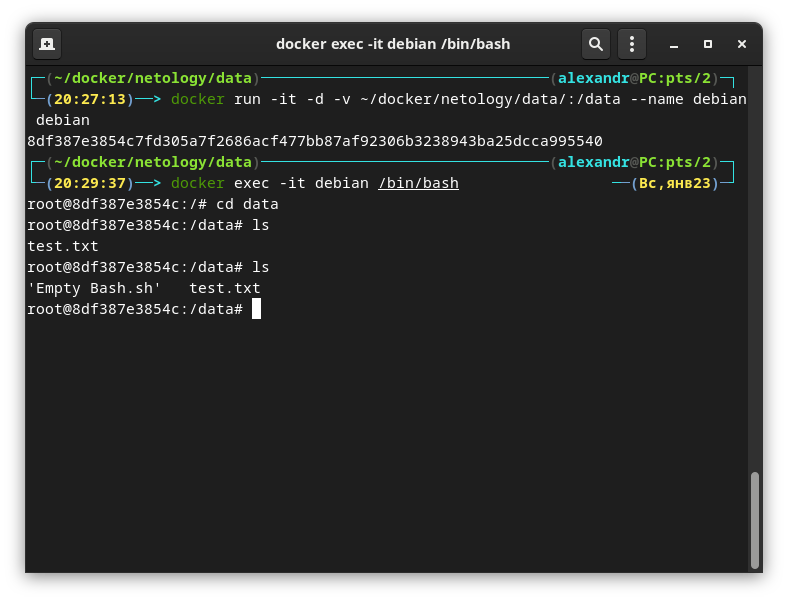

# Домашнее задание к занятию "5.3. Введение. Экосистема. Архитектура. Жизненный цикл Docker контейнера"

## Задача 1

Сценарий выполнения задачи:

- создайте свой репозиторий на https://hub.docker.com;
- выберете любой образ, который содержит веб-сервер Nginx;
- создайте свой fork образа;
- реализуйте функциональность:
запуск веб-сервера в фоне с индекс-страницей, содержащей HTML-код ниже:
```html
<html>
<head>
Hey, Netology
</head>
<body>
<h1>I’m DevOps Engineer!</h1>
</body>
</html>
```
Опубликуйте созданный форк в своем репозитории и предоставьте ответ в виде ссылки на https://hub.docker.com/username_repo.

https://hub.docker.com/r/gaoroot/nginx

## Задача 2

Посмотрите на сценарий ниже и ответьте на вопрос:
"Подходит ли в этом сценарии использование Docker контейнеров или лучше подойдет виртуальная машина, физическая машина? Может быть возможны разные варианты?"

Детально опишите и обоснуйте свой выбор.

--

Сценарий:

- Высоконагруженное монолитное java веб-приложение;  
Физический сервер. Но возможен вариант использования среды виртуализации.
Для большинства веб-приложений   

- Nodejs веб-приложение;  
Для web-приложения на node.js подойдет Docker контейнер.  

- Мобильное приложение c версиями для Android и iOS;  
Виртуальная машина, так-как надо эмулирвоать среду для запускаемого приложения.

- Шина данных на базе Apache Kafka;  
Подойдет как Docker контейнер так и виртуальная машина.  

- Elasticsearch кластер для реализации логирования продуктивного веб-приложения - три ноды elasticsearch, два logstash и две ноды kibana;  
Docker контейнер, на лицо необходимость так называемого горизонтального масштабирования и  отказоустойчивости.

- Мониторинг-стек на базе Prometheus и Grafana;  
Docker контейнер, такая популярна и на контейнерах, хотя можно устанавливать и в среде виртуализации, зависит от поставленных задач.

- MongoDB, как основное хранилище данных для java-приложения;  
Субд в контейнер, а базу в хранилище(может быть и отдельная виртуальная машина)

- Gitlab сервер для реализации CI/CD процессов и приватный (закрытый) Docker Registry.  
В среде виртуализации для выделения физических ресурсов для  виртуальной машины.

P.S.  
Для всех вышеописанных сценариев, в интернете существует множество статей на тему, реализации использования Docker контейнеров
Видимо тут стоит отталкиваться от конкретной задачи и экономической целесообразности того или иного решения.


## Задача 3

- Запустите первый контейнер из образа ***centos*** c любым тэгом в фоновом режиме, подключив папку ```/data``` из текущей рабочей директории на хостовой машине в ```/data``` контейнера;
- Запустите второй контейнер из образа ***debian*** в фоновом режиме, подключив папку ```/data``` из текущей рабочей директории на хостовой машине в ```/data``` контейнера;
- Подключитесь к первому контейнеру с помощью ```docker exec``` и создайте текстовый файл любого содержания в ```/data```;
- Добавьте еще один файл в папку ```/data``` на хостовой машине;
- Подключитесь во второй контейнер и отобразите листинг и содержание файлов в ```/data``` контейнера.

Запускаю контейнер с образом `debian` и именем `debian` и подключаю папку `data`

`docker run -it -d -v ~/docker/netology/data/:/data --name debian debian`  
`docker exec -it debian /bin/bash`




`docker run -it -d -v ~/docker/netology/data/:/data --name centos centos`  
`docker exec -it centos /bin/bash`




Создал файл на хостовой машине.  







## Задача 4 (*)

Воспроизвести практическую часть лекции самостоятельно.

Соберите Docker образ с Ansible, загрузите на Docker Hub и пришлите ссылку вместе с остальными ответами к задачам.

https://hub.docker.com/r/gaoroot/ansible
