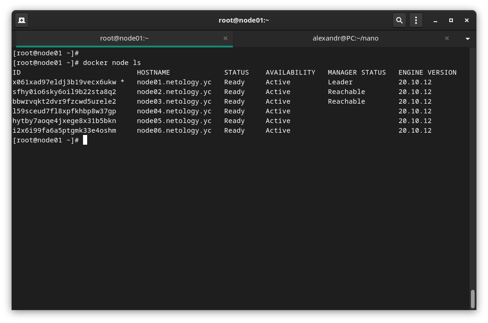
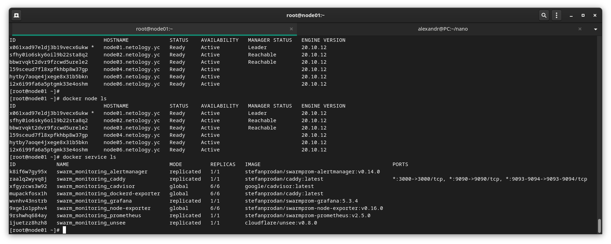

# Домашнее задание к занятию "5.5. Оркестрация кластером Docker контейнеров на примере Docker Swarm"

## Задача 1

Дайте письменные ответы на следующие вопросы:

- В чём отличие режимов работы сервисов в Docker Swarm кластере: replication и global?  
    - В режиме replicated указывается сколько одинаковых контейнеров запустить, можно развернуть пять nginx реплик, каждая из которых выдаёт одно и тоже.   
    - global запускает одну задачу на каждой ноде.  

- Какой алгоритм выбора лидера используется в Docker Swarm кластере?  
    - Нода лидер, служит лидером для выполнения задач, связанных с оркестровкой. Для выбора лидера в Docker Swarm кластере используется алгоритм "Raft"    

- Что такое Overlay Network?  
    - Сети создаваемые поверх другой сети. Узлы оверлейной сети могут быть связаны либо физическим соединением, либо логическим, для которого в основной сети существуют один или несколько соответствующих маршрутов из физических соединений.
    

## Задача 2

Создать ваш первый Docker Swarm кластер в Яндекс.Облаке

Для получения зачета, вам необходимо предоставить скриншот из терминала (консоли), с выводом команды:
```
docker node ls
```



## Задача 3

Создать ваш первый, готовый к боевой эксплуатации кластер мониторинга, состоящий из стека микросервисов.

Для получения зачета, вам необходимо предоставить скриншот из терминала (консоли), с выводом команды:
```
docker service ls
```


## Задача 4 (*)

Выполнить на лидере Docker Swarm кластера команду (указанную ниже) и дать письменное описание её функционала, что она делает и зачем она нужна:
```
# см.документацию: https://docs.docker.com/engine/swarm/swarm_manager_locking/
docker swarm update --autolock=true
```
