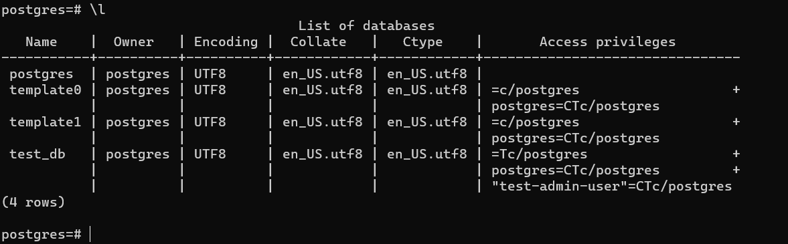
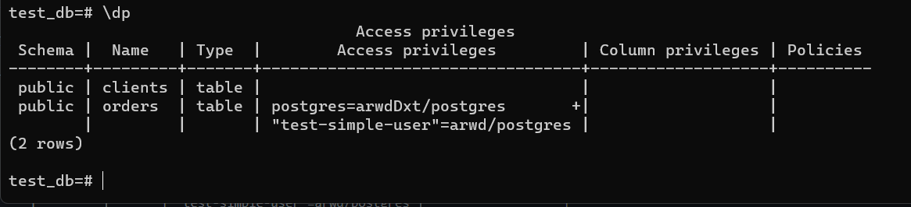
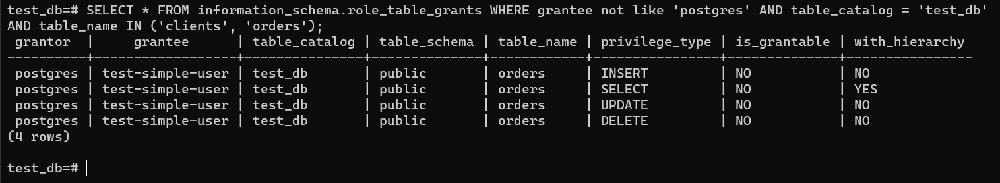
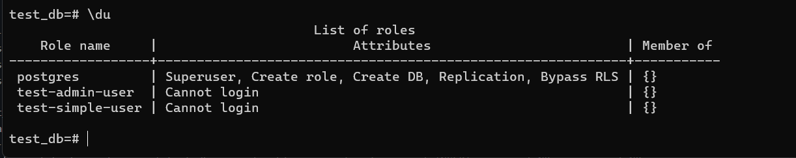
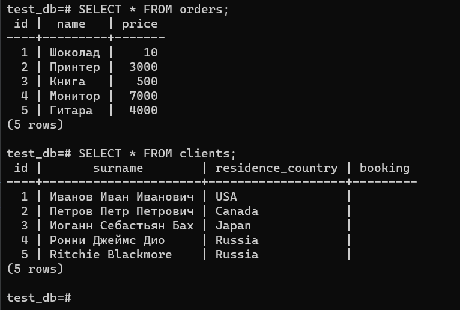
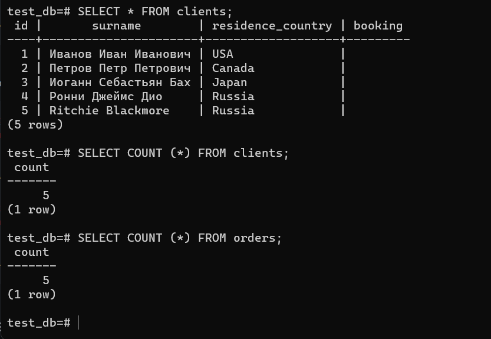
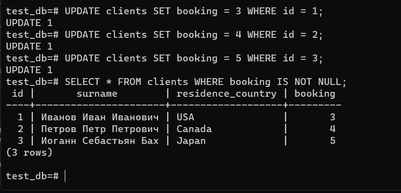
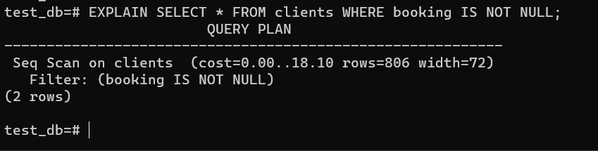
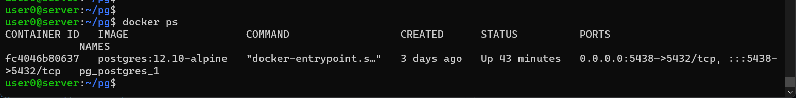

# Домашнее задание к занятию "6.2. SQL"

## Введение

Перед выполнением задания вы можете ознакомиться с 
[дополнительными материалами](https://github.com/netology-code/virt-homeworks/tree/master/additional/README.md).

## Задача 1

Используя docker поднимите инстанс PostgreSQL (версию 12) c 2 volume, 
в который будут складываться данные БД и бэкапы.

Приведите получившуюся команду или [docker-compose манифест](docker-compose.yml).

```yaml
version: '3.7'
services:
    postgres:
        image: postgres:12.10-alpine
        restart: always
        environment:
          - POSTGRES_USER=postgres
          - POSTGRES_PASSWORD=postgres
        ports:
          - '5438:5432'
        volumes:
          - ./data:/var/lib/postgresql/data
          - ./backup:/var/lib/postgresql/backup
```

## Задача 2

Подключаюсь к койънтейнеру  
```
docker exec -it fc4046b80637 /bin/bash
```
Подключаюсь к postgresql
```
psql -U postgres
```

В БД из задачи 1: 
- создайте пользователя test-admin-user и БД test_db
```sql
CREATE DATABASE test_db;
CREATE ROLE "test-admin-user";
GRANT ALL PRIVILEGES ON DATABASE test_db TO "test-admin-user";
GRANT USAGE, CREATE ON SCHEMA public TO "test-admin-user";
GRANT ALL PRIVILEGES ON ALL TABLES IN SCHEMA public TO "test-admin-user";
```
- в БД test_db создайте таблицу orders и clients (спeцификация таблиц ниже)
```
\c test_db
```
```sql
CREATE TABLE orders (id integer PRIMARY KEY, name text, price integer);

CREATE TABLE clients (id integer PRIMARY KEY, surname text, residence_country text, booking integer, FOREIGN KEY (booking) REFERENCES orders (id));

CREATE INDEX countryid ON clients(residence_country); 
```
- предоставьте привилегии на все операции пользователю test-admin-user на таблицы БД test_db
```sql
GRANT ALL ON DATABASE test_db to "test-admin-user";
```
- создайте пользователя test-simple-user  
```sql
CREATE USER "test-simple-user" WITH ENCRYPTED PASSWORD 'testsimpleuserpass';
```
- предоставьте пользователю test-simple-user права на SELECT/INSERT/UPDATE/DELETE данных таблиц БД test_db
```sql
GRANT SELECT,INSERT,UPDATE,DELETE ON TABLE public.clients TO "test-simple-user";
GRANT SELECT,INSERT,UPDATE,DELETE ON TABLE public.orders TO "test-simple-user";
```

Таблица orders:
- id (serial primary key)
- наименование (string)
- цена (integer)

Таблица clients:
- id (serial primary key)
- фамилия (string)
- страна проживания (string, index)
- заказ (foreign key orders)

Приведите:
- итоговый список БД после выполнения пунктов выше,  

- описание таблиц (describe)

- SQL-запрос для выдачи списка пользователей с правами над таблицами test_db
```sql
SELECT * FROM information_schema.role_table_grants WHERE grantee not like 'postgres' AND table_catalog = 'test_db' AND table_name IN ('clients', 'orders');
```

- список пользователей с правами над таблицами test_db


## Задача 3

Используя SQL синтаксис - наполните таблицы следующими тестовыми данными:

```sql
INSERT INTO orders VALUES (1, 'Шоколад', 10), (2, 'Принтер', 3000), (3, 'Книга', 500), (4, 'Монитор', 7000), (5, 'Гитара', 4000);

INSERT INTO clients VALUES (1, 'Иванов Иван Иванович', 'USA'), (2, 'Петров Петр Петрович', 'Canada'), (3, 'Иоганн Себастьян Бах', 'Japan'), (4, 'Ронни Джеймс Дио', 'Russia'), (5, 'Ritchie Blackmore', 'Russia');
```

Таблица orders

|Наименование|цена|
|------------|----|
|Шоколад| 10 |
|Принтер| 3000 |
|Книга| 500 |
|Монитор| 7000|
|Гитара| 4000|

Таблица clients

|ФИО|Страна проживания|
|------------|----|
|Иванов Иван Иванович| USA |
|Петров Петр Петрович| Canada |
|Иоганн Себастьян Бах| Japan |
|Ронни Джеймс Дио| Russia|
|Ritchie Blackmore| Russia|

Используя SQL синтаксис:
- вычислите количество записей для каждой таблицы 
- приведите в ответе:
    - запросы 
    - результаты их выполнения.

```sql
SELECT * FROM orders;
SELECT * FROM clients;

SELECT COUNT (*) FROM clients;
SELECT COUNT (*) FROM orders;
```




## Задача 4

Часть пользователей из таблицы clients решили оформить заказы из таблицы orders.

Используя foreign keys свяжите записи из таблиц, согласно таблице:

|ФИО|Заказ|
|------------|----|
|Иванов Иван Иванович| Книга |
|Петров Петр Петрович| Монитор |
|Иоганн Себастьян Бах| Гитара |

Приведите SQL-запросы для выполнения данных операций.

Приведите SQL-запрос для выдачи всех пользователей, которые совершили заказ, а также вывод данного запроса.
 
Подсказк - используйте директиву `UPDATE`.


```sql
UPDATE clients SET booking = 3 WHERE id = 1;

UPDATE clients SET booking = 4 WHERE id = 2;

UPDATE clients SET booking = 5 WHERE id = 3;

SELECT * FROM clients WHERE booking IS NOT NULL;
```



## Задача 5

Получите полную информацию по выполнению запроса выдачи всех пользователей из задачи 4 
(используя директиву EXPLAIN).

```sql
EXPLAIN SELECT * FROM clients WHERE booking IS NOT NULL;
```



Приведите получившийся результат и объясните что значат полученные значения.

План выполнения запроса и фильтр по полю booking.

## Задача 6

Создайте бэкап БД test_db и поместите его в volume, предназначенный для бэкапов (см. Задачу 1).

Остановите контейнер с PostgreSQL (но не удаляйте volumes).

Поднимите новый пустой контейнер с PostgreSQL.

Восстановите БД test_db в новом контейнере.

Приведите список операций, который вы применяли для бэкапа данных и восстановления. 

    pg_dump -U postgres test_db > backup/test_db.sql

    psql -U postgres < backup/test_db.sql
Первый контейнер с postgresql

```console
bash-5.1# cd /var/lib/postgresql/
bash-5.1# ls
backup  data
bash-5.1# pg_dump -U postgres test_db > backup/test_db.sql
bash-5.1#
```

```console
user0@server:~/pg_2$ docker-compose up -d
Creating network "pg_2_default" with the default driver
Creating pg_2_postgres_1 ... done
user0@server:~/pg_2$ docker ps
CONTAINER ID   IMAGE                   COMMAND                  CREATED         STATUS         PORTS
              NAMES
5f891a4ccf6c   postgres:12.10-alpine   "docker-entrypoint.s…"   5 seconds ago   Up 3 seconds   0.0.0.0:5438->5432/tcp, :::5438->5432/tcp   pg_2_postgres_1
user0@server:~/pg_2$ docker exec -it 5f891a4ccf6c /bin/bash
bash-5.1#
```

```
bash-5.1# psql -U postgres -c 'CREATE DATABASE test_db;'
CREATE DATABASE
bash-5.1# psql -U postgres -d test_db -f backup/test_db.sql
```

```
postgres=# \l
                                 List of databases
   Name    |  Owner   | Encoding |  Collate   |   Ctype    |   Access privileges
-----------+----------+----------+------------+------------+-----------------------
 postgres  | postgres | UTF8     | en_US.utf8 | en_US.utf8 |
 template0 | postgres | UTF8     | en_US.utf8 | en_US.utf8 | =c/postgres          +
           |          |          |            |            | postgres=CTc/postgres
 template1 | postgres | UTF8     | en_US.utf8 | en_US.utf8 | =c/postgres          +
           |          |          |            |            | postgres=CTc/postgres
 test_db   | postgres | UTF8     | en_US.utf8 | en_US.utf8 |
(4 rows)

postgres=#
```

---

