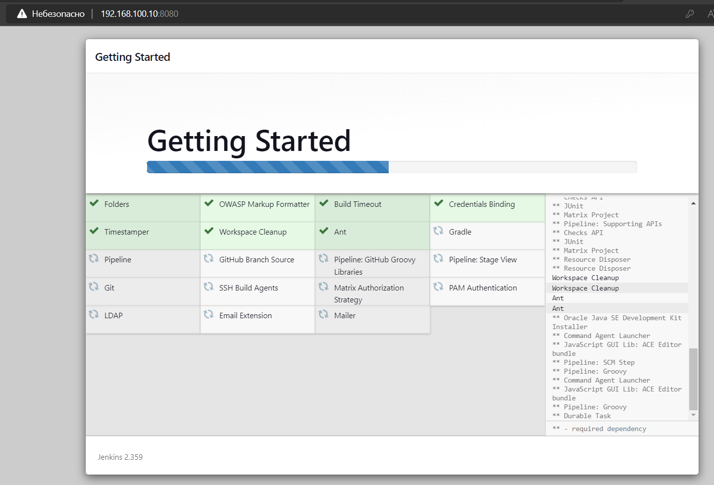
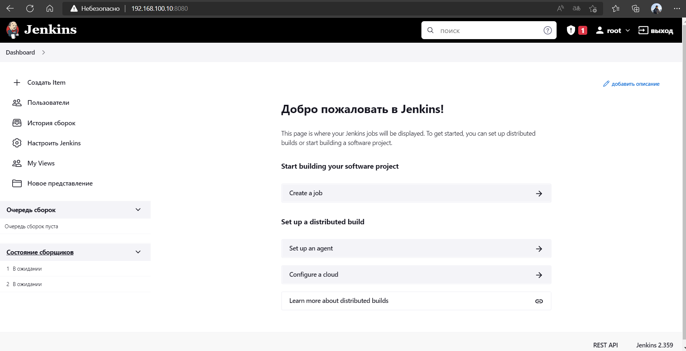
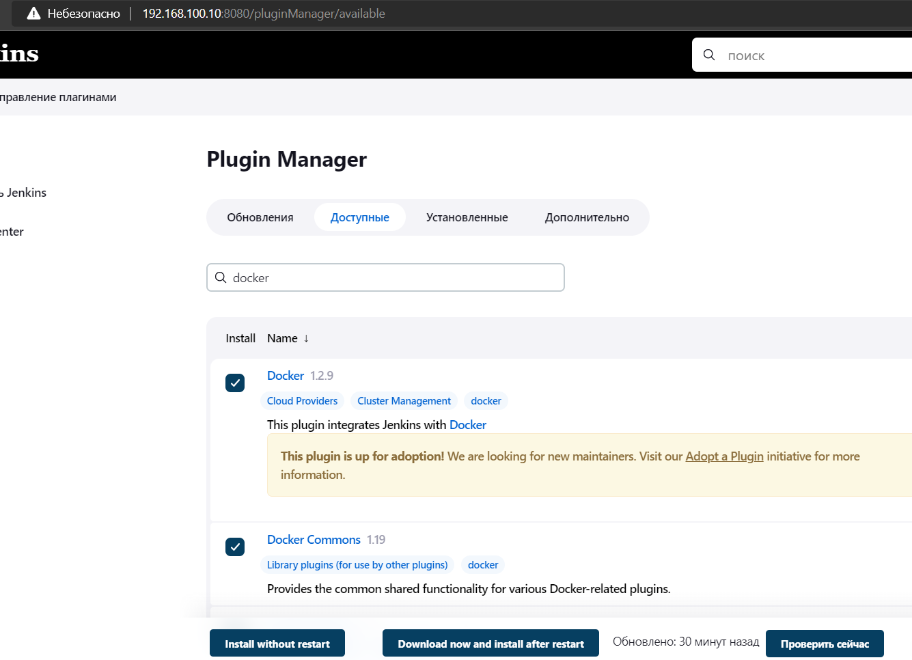
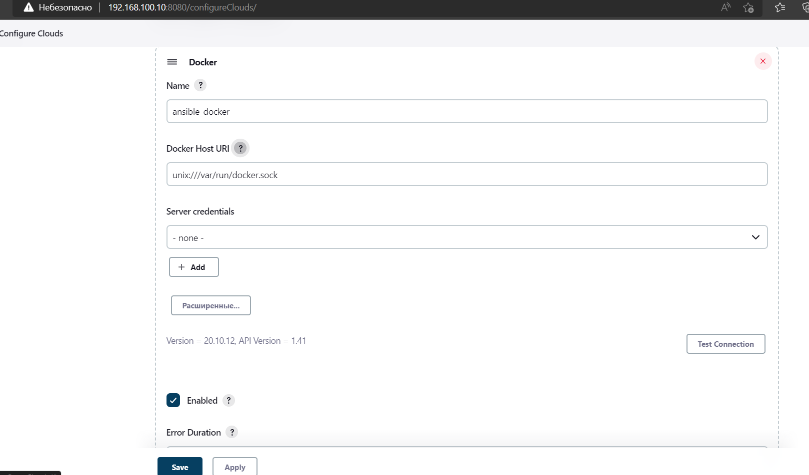
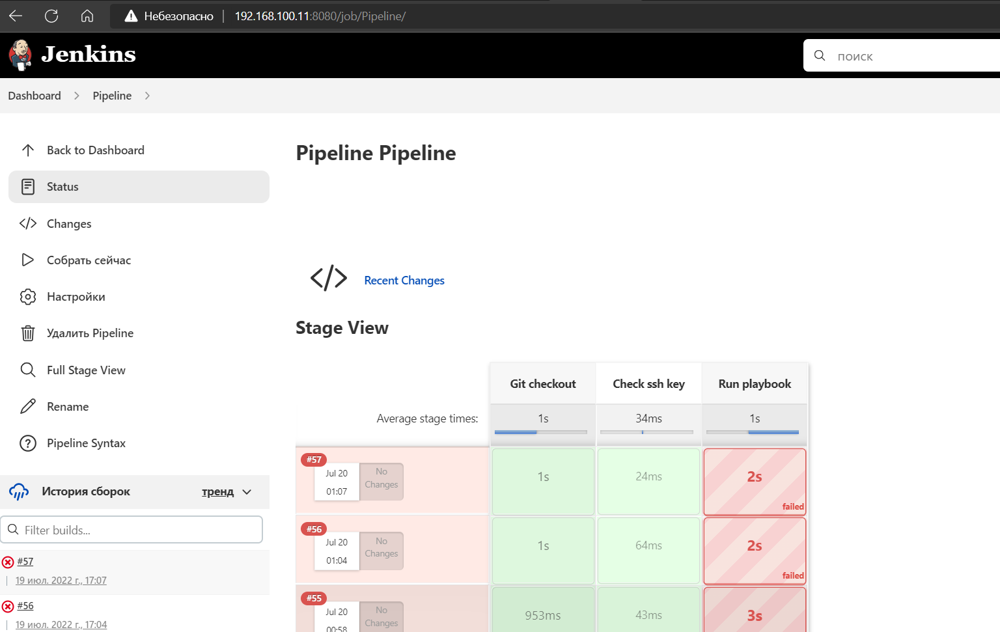
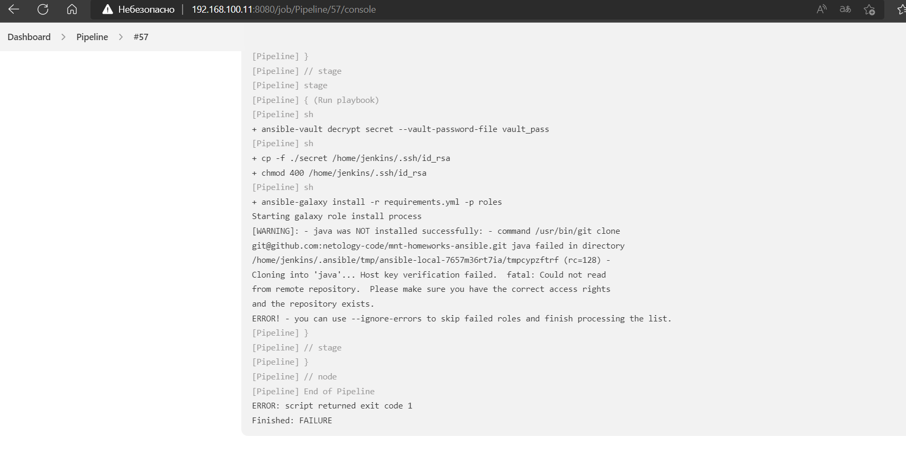

# Домашнее задание к занятию "09.03 Jenkins"

## Подготовка к выполнению

1. Установить jenkins по любой из [инструкций](https://www.jenkins.io/download/)  
docker-compose.yml
```yaml
version: '3.6'
services:
  jenkins:
    image: jenkins/jenkins:latest-jdk11
    privileged: true
    user: root
    container_name: "jenkins_lts-jdk11"
    volumes:
      - ./jenkins_home/:/var/jenkins_home
      - /var/run/docker.sock:/var/run/docker.sock:rw
      - /usr/bin/docker:/usr/bin/docker
    ports:
      - 8080:8080
    restart: always
```
2. Запустить и проверить работоспособность
```
user0@server:~$ docker-compose up -d
Pulling jenkins (jenkins/jenkins:latest-jdk11)...
latest-jdk11: Pulling from jenkins/jenkins
1339eaac5b67: Pull complete
05901b0891d4: Pull complete
f95dea4c489f: Pull complete
5f2c45ee3c66: Pull complete
6ce2320eefc8: Pull complete
8489a45c4910: Pull complete
3a2cf0755c15: Pull complete
bf4a9b86ad6a: Pull complete
bfd385f9c08b: Pull complete
1c20bb2aae87: Pull complete
fc54cc4c658c: Pull complete
3deac8bc66c7: Pull complete
bc4de5bf3bef: Pull complete
75c0aa85ca62: Pull complete
Digest: sha256:ee888f3d59da4f23efcb532bbfecb5c7c062679aec52835609370a0f23950daf
Status: Downloaded newer image for jenkins/jenkins:latest-jdk11
Creating jenkins_lts-jdk11 ... done
user0@server:~$ docker-compose ps
      Name                     Command               State                          Ports
----------------------------------------------------------------------------------------------------------------
jenkins_lts-jdk11   /usr/bin/tini -- /usr/loca ...   Up      50000/tcp, 0.0.0.0:8080->8080/tcp,:::8080->8080/tcp
user0@server:~$
user0@server:~$ docker exec jenkins_lts-jdk11 cat /var/jenkins_home/secrets/initialAdminPassword
d298f646975548d6abc3685aaa4e640d
user0@server:~$
```
3. Сделать первоначальную настройку


4. Настроить под свои нужды
5. Поднять отдельный cloud

6. Для динамических агентов можно использовать [образ](https://hub.docker.com/repository/docker/aragast/agent)
7. Обязательный параметр: поставить label для динамических агентов: `ansible_docker`

8.  Сделать форк репозитория с [playbook](https://github.com/aragastmatb/example-playbook)

## Основная часть

1. Сделать Freestyle Job, который будет запускать `ansible-playbook` из форка репозитория
2. Сделать Declarative Pipeline, который будет выкачивать репозиторий с плейбукой и запускать её
3. Перенести Declarative Pipeline в репозиторий в файл `Jenkinsfile`
4. Перенастроить Job на использование `Jenkinsfile` из репозитория
5. Создать Scripted Pipeline, наполнить его скриптом из [pipeline](./pipeline)
6. Заменить credentialsId на свой собственный
7. Проверить работоспособность, исправить ошибки, исправленный Pipeline вложить в репозитрий в файл `ScriptedJenkinsfile`
8. Отправить ссылку на репозиторий в ответе

[ScriptedJenkinsfile](ScriptedJenkinsfile)




## Необязательная часть

1. Создать скрипт на groovy, который будет собирать все Job, которые завершились хотя бы раз неуспешно. Добавить скрипт в репозиторий с решеним с названием `AllJobFailure.groovy`
2. Установить customtools plugin
3. Поднять инстанс с локальным nexus, выложить туда в анонимный доступ  .tar.gz с `ansible`  версии 2.9.x
4. Создать джобу, которая будет использовать `ansible` из `customtool`
5. Джоба должна просто исполнять команду `ansible --version`, в ответ прислать лог исполнения джобы 
